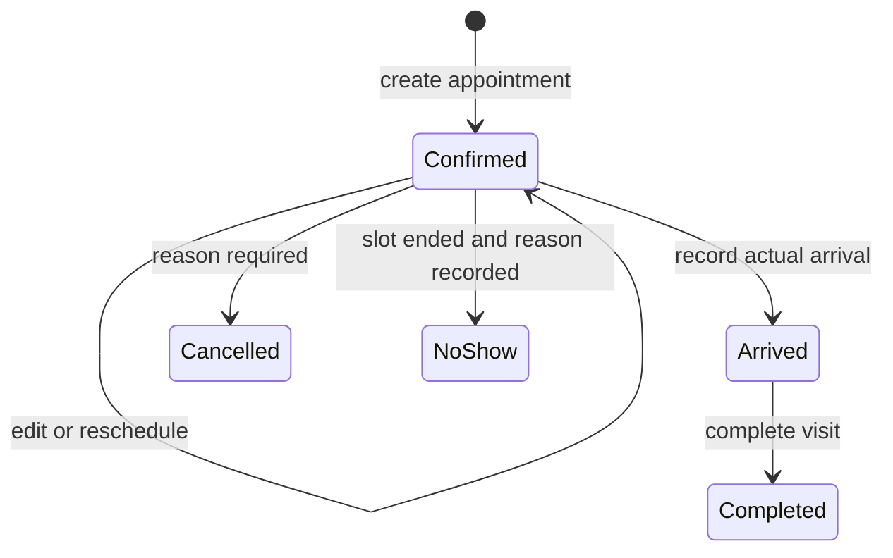
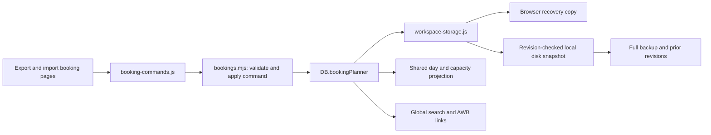

# Internal warehouse booking prototype

Delivered in version 2.1.0 on `codex/booking-planner`. Customer service enters bookings locally; customers do not sign in or submit requests through an external portal. The booking records an appointment against an existing master AWB. It does not issue an AWB, transmit an ERP quote, accept cargo or authorize release.

## Using the booking desk

1. Open **Export Bookings** for deliveries to DWC or **Import Bookings** for collections from DWC. Choose the planning date; all appointment times are explicitly **Asia/Dubai (UTC+04)** regardless of the computer's timezone.
2. Create a booking with the existing AWB, customer, airport route, pieces, gross weight, cargo type, SHC, arrival window and required staff. Export origin is DWC; import destination is DWC. Flight, vehicle and dock references are optional planning details. Start with the empty planner or explicitly save a labelled synthetic sample.
3. Record whether customs or police coordination is needed, whether arrangements have been recorded, the responsible owner and notes. These are internal coordination records; they do not prove an authority has approved or cleared the cargo.
4. Set available staff and concurrent-visit capacity. Both directions contribute to the shared demand strip, even when the agenda list is filtered. Capacity is a warning, not an automatic refusal. An unset value is displayed as **Not set**. Requirements are entered by the operator; the app does not predict staffing from cargo weight.
5. Record actual arrival, then complete the visit. Rescheduling, cancellation, no-show marking and waivers retain attributed reasons in history. A completed visit is distinct from cargo acceptance or release.

Global search includes booking reference, AWB, customer and flight. Shipment details link related bookings through normalized AWB and direction. A booking's direction stays fixed after creation; an AWB correction is editable and audited. Reused AWBs can represent different visits: only overlapping active bookings for the same AWB and direction are rejected. The app has no authoritative external AWB registry.

## Lifecycle and late handling

The prototype defines the **slot as the arrival window**. Arrival after its end is late; an unarrived confirmed visit becomes overdue. This definition is an internal prototype assumption, not a verified dnata billing rule. No-show is an explicit operator decision after the window ends and creates no charge. A new appointment can be made for a subsequent visit. The original no-show stays in history.

An optional company policy can propose one fixed AED amount when actual arrival exceeds the window end plus the configured grace period. It is disabled initially. Each booking captures the policy when created; later setting changes and rescheduling do not reprice that booking. Disabled policy means **Not configured**, not free service under an approved tariff. A proposal is never added to an invoice, revenue metric or payment balance. Waiving a proposal preserves the original amount, operator, time and reason.

Do not confuse appointment lateness, terminal entry windows, no-shows and late acceptance relative to flight departure. The existing advice tariff is independent. Read the [dnata reference and source limits](dnata-reference.md) before assigning any commercial rate.

Historical booking creation and every slot change require reasons. Arrival times cannot be more than one minute ahead of the current clock; recording arrival for a previous calendar day requires a reason. Arrived bookings permit coordination edits only. Terminal visits are retained rather than deleted. This is an intentionally limited prototype workflow; correcting an erroneous arrival or reopening a terminal record needs a future audited correction command.

The workload chart represents **planned windows**, including completed visits for the selected day's plan. It excludes cancelled visits and no-shows. It is not live dock occupancy: late arrivals, overruns and actual service duration are not automatically converted into staff allocations. Capacity is a single workspace setting, not a dated shift roster or skill-specific allocation.

## Data and implementation

The pure domain module runs in both client and server validation. It owns booking identity, lifecycle, quantity/date checks, policy snapshots, assessments, history and the overlapping-window demand calculation. UI actions call one command adapter, which returns failure and restores the previous planner if local persistence rejects the change. Disk acknowledgement remains asynchronous and visible in the storage banner.

`DB.bookingPlanner` contains a version, bookings, shared capacity, default late policy and settings history. Booking history records actor labels, UTC recording times, reasons and changed values. These local records are editable by someone with machine/file access and are not a tamper-proof audit service. The staff selector is attribution, not login.

Full JSON backups and disk snapshots include the planner. Older backups without it migrate to an empty planner; the restore dialog explicitly warns that existing bookings would be cleared. Malformed booking data is rejected before replacing the workspace. No operational data is placed in Git, and tests use synthetic records in isolated stores.

## Validation and next decisions

Run `pnpm verify` for domain, local-server and browser tests. Dedicated booking checks cover civil-time conversion, overlap boundaries, policy capture and waiver, no-shows, shared capacity, lifecycle rejection, browser interaction, failed saves, backup restore and disk round trips.

Before extending the prototype, the operations owner needs to confirm arrival-window semantics, service duration, staffing/shift capacity, required documentation, who records authority arrangements, correction procedures and an approved commercial policy. A shared customer portal or ERP integration would additionally need authenticated access and a separately reviewed deployment design. None is activated by this delivery.

ULD reconciliation remains a [separate exploration](../uld/exploration.md), with no mailbox ingestion or ULD inventory implemented.

### Verification record — 14 September 2026

- `node --test tests/server.test.js tests/bookings.test.js`: **32/32 passed** (16 server, 16 booking-domain cases).
- Targeted browser runs: workspace navigation **3/3**, persistence/recovery **10/10**, and booking workflows **4/4** passed. Booking tests include a mobile form reopen/scroll regression found during visual review.
- The integrated test run exposed one recovered disk write returning 507. The original incident did not recur in 24 focused repetitions. The server now retries temporary atomic-rename denials within a finite budget; injected temporary and permanent failures verify both recovery and preservation. No antivirus cause was established.
- Desktop and 390-pixel mobile layouts were inspected through the app. The launcher restarted version 2.1 while preserving the saved snapshot's exact hash, workspace identity and revision.
- Complete browser-regression and CI results are recorded in the feature's draft pull request and local `tests/output/booking-*-verification.log` files. Runtime logs and workspaces remain outside Git.
