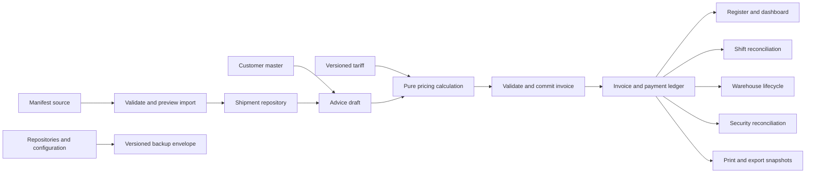

# Architecture, safety, and migration audit

Audit date: 14 September 2026. Baseline: commit `f0f0fdb` on `audit/full-repo-review`, also the inspected `main` and `origin/main` tip. All application line references below refer to that baseline, so subsequent implementation does not invalidate the evidence.

**Historical baseline review.** The monolithic HTML has been removed from the working tree. Read the [archived application at the exact reviewed commit](https://github.com/nre17/Buddy-Audit/blob/f0f0fdb5cc506bfd3dfc0c465395c165c2bae4ce/app/solitair-invoicing.html#L1) for source evidence, and the [revamp index](README.md) / [system map](system-map.md) for the current implementation. Baseline risks below are not an assertion that the same defect remains after the integrated fixes.

## Assessment

The repository contains a substantial cargo-counter workflow prototype, not just a static mockup. Its strongest assets are its documented tariff behavior, AWB-first manifest ingestion, separation of AWB owner from billing party, controlled printed documents, and regression cases for past defects. Those should survive the redesign.

The present architecture is unsuitable as the foundation for a shared operational system: browser storage is the only ledger, persistence failures can be reported as successful saves, imports are not schema-validated, and users can change or delete financial records without an audit trail. A new visual shell alone does not resolve these issues.

The user's explicit authorization for a modular application supersedes the historical single-file and adjacent-refactor restrictions in `CLAUDE.md`. This audit does not treat that authorization as permission to invent different tariffs or silently rewrite historical invoice values. It recommends migrating the known workflows and improving validation, storage, and observability around them.

## What was inspected

The baseline has 41 tracked files. The architecture/security review covered the application state, persistence, imports/restores, invoice-save, rendering, export, printing, warehouse, and boot paths; the test harness and runner; test inventories and relevant regression specs; both tools; all tracked infrastructure/configuration; and the documentation set. Large embedded assets and the customer-master rows were excluded from text reads. Domain and visual reviews are separate workstreams.

| Area | Baseline contents | Disposition |
|---|---|---|
| Application | One HTML file, about 6,145 lines and 779 KB; global state, CSS, data, rendering, and business rules | Extract into modules; retain the baseline as a reference during migration |
| Customer data | Deterministic Python generator, JSON fixture, second copy embedded in HTML | Keep one canonical generated fixture and import it at build time |
| Demo operational data | Two JSON fixtures plus separate in-app seeding functions | Keep generated demo scenarios; consolidate duplicated scenario definitions |
| Documentation | Architecture, model, tariff, code map, findings, runbook, ERP specification, data protection, governance | Valuable, but several assertions are obsolete or contradictory; update against observed behavior |
| Tests | 12 spec files, 106 exported cases, custom Playwright runner | Retain as behavioral evidence; extend failure-path coverage and point migrated tests at the new runtime |
| Tooling | PII pattern scanner and reproducible customer generator | Keep and improve scope, output, and artifact guards |
| Git/CI | Two remotes; four merged feature/fix branch tips on the fork; Ubuntu/Node 20 CI | Preserve upstream provenance, adopt a lockfile and build/type/test gates, then prune verified merged fork branches |

## Verified defects and control gaps

Priority here means migration urgency, not an assertion that the demo is deployed to production. P1 issues can lose, misstate, or expose data; P2 issues make the application hard to operate or maintain safely.

| ID | Priority | Evidence at baseline | Consequence and required change |
|---|---|---|---|
| R-01 | P1 | [`save()` at baseline line 2518](https://github.com/nre17/Buddy-Audit/blob/f0f0fdb5cc506bfd3dfc0c465395c165c2bae4ce/app/solitair-invoicing.html#L2518) catches write failures and returns no outcome. `saveAdvice()` at 3963–3979 then displays success, refreshes derived views, and resets the form. | A failed disk/browser-storage write looks like a successful invoice. Make save transactional from the caller's perspective: validate a candidate, persist, then publish state and reset. Preserve the draft and old sequence on failure. Existing finding A-04 understates the success-toast overwrite. |
| R-02 | P1 | `load()` at 2523–2550 checks only truthiness of `entries`, assigns `DB = o`, then assumes arrays. Restore at 4923–4927 checks only `o.entries`, overwrites storage, and calls `boot()` without `load()` migrations. Security restore at 5815–5817 checks only the top-level array. | Malformed or legacy backups can overwrite working state and leave the UI broken or historically incomplete. Use versioned schemas, migrations, an import preview, and an atomic replacement only after validation. Preserve rejected input for recovery outside the repository. |
| R-03 | P1 | Whole-ledger `localStorage.setItem` at 2518; state loaded only at initial `load()` at 6140; no storage-event conflict handler or write revision. Reference allocation reads an in-memory counter at 3954–3956. | Two open instances can read the same revision and overwrite each other's changes. The browser-only phase needs a single-writer/conflict policy; a shared system needs server-side transactions and reference allocation. Changing to IndexedDB alone does not supply multi-machine synchronization. |
| R-04 | P1 | General backup at 4914 serializes `DB` only. Warehouse state uses a separate key at 5517–5520 and retains manual records, cleared history, and removal markers. Manifest state is separate at 2606–2615. | The general backup cannot fully restore the workspace. Introduce a versioned backup envelope containing ledger, warehouse state, settings, and integrity metadata; explicitly state whether the re-importable manifest is included. Existing runbook accepts losing manually entered warehouse records. |
| R-05 | P1 | Unescaped staff option text in `sel()` at 2515 and `handoverDialog()` at 4154; stored logo interpolated into HTML attributes at 4345 and 5374; matched invoice reference inserted unescaped at 5851. Settings accept staff strings at 4898–4901; restore accepts arbitrary logo values. | User or backup-controlled text can become executable HTML. Prefer text rendering, validate stored asset types/URLs, and escape every residual HTML sink. A staff-label injection was confirmed in an isolated Edge page using the actual baseline handover renderer and an inert local marker. No network or counter data was involved. |
| R-06 | P1 | Save validates weight/pieces with `if(!e.wt || !e.pcs)` at 3931; payment validation at 3943–3950 only demands a reason when totals differ. Numeric `min` attributes are not checked by this button handler. | Negative weights, pieces, or payments can pass. Validate finite positive weight, positive integer pieces, nonnegative payment amounts, permitted numeric ranges, and timestamp ordering in the domain layer. Preserve legitimate partial-payment behavior with an explicit reason. |
| R-07 | P1 | CSV serialization at 4633–4635 only quotes CSV delimiters. Text remarks/customer/reference cells are supplied by `regRows()` at 4448–4469. | A formula-shaped value remains a formula-shaped cell in a spreadsheet. Introduce safe text serialization for exported user text. The XLSX writer already emits strings as `inlineStr` at 4533 and should retain that property. |
| R-08 | P1 | Default backup filename at 4914 is `SolitAir_Invoicing_Backup_<stamp>.json`. `.gitignore:14–17` and `.github/workflows/ci.yml:55` block other backup patterns, not this name. Scanner rules at `tools/pii-scan.js:70` identify only a limited set of contact/number shapes. | An ordinary downloaded backup is not blocked by filename. Align generated names with guards, block every exported backup family, scan tracked artifact metadata, and retain human review. Do not interpret a clean regex scan as proof that a file contains no confidential information. |
| R-09 | P1 | `applySiteOverrides()` at 6040–6044 only replaces nonempty company fields; `applyRateOverrides()` at 4983–4988 only replaces listed tariff overrides. Restore at 4927 calls `boot()` without resetting shipped configuration. | Restoring a backup without the previous settings can retain those previous company details or rates in memory until reload. Derive effective configuration from immutable defaults plus the restored settings on every load. |
| R-10 | P2 | Calculation duplicated in `recalcLine()` at 3735–3744 and `collectAdvice()` at 3796–3820; raw floating-point charges are summed while display is rounded separately. | UI and persisted values can drift after future edits; displayed line totals can fail to reconcile to a rounded document total. Extract one pure money calculation, specify rounding boundaries explicitly, and preserve historic invoice snapshots. A rounding-policy change requires an explicit domain decision. |
| R-11 | P2 | `ackSelected()` at 5954–5966 loops over all rendered reception rows without selection controls. | “Clear Selected” acknowledges every visible record. Add real selection or accurately label an explicit acknowledge-all-visible action. Existing A-05 remains open. |
| R-12 | P2 | Invoice deletion filters the ledger at 4118, removes linked warehouse records, and saves without a deletion record. Staff is a dropdown, not authenticated identity. | Users cannot reconstruct who altered the ledger or why. Preserve source invoices; add void/correction records and an append-only audit event stream when creating the operational model. Do not recycle voided references: the ERP specification explicitly says not to reuse them. |
| R-13 | P2 | `refFor()`/`previewRef()` at 2477–2480 use a date plus a continuously incrementing per-direction sequence. | The intended daily-reset sequence is absent. Implement a tested numbering policy when migrating new invoices, preserving old references and distinguishing record identity from display reference. Check midnight, separate directions, concurrent saves, and voids. |
| R-14 | P2 | `boot()` at 6086–6106 eagerly builds every feature against globals; forms are strings and event handlers are rebound after replacements. Persisted `DB.customers` duplicates the shipped list. | A small feature change can invalidate distant views; repeated source/data copies increase review cost and storage writes. Introduce feature boundaries, explicit domain dependencies, and one canonical customer dataset. |

### Evidence from isolated probes

These were executed against source extracted from `git show f0f0fdb:app/solitair-invoicing.html`, without altering the app or running the full suite:

1. A stubbed storage write threw. Actual `save()` plus `saveAdvice()` emitted `Could not save` followed by an `Invoice saved` success notification; the in-memory ledger grew and the sequence advanced. The same handler accepted negative weight/pieces and a negative payment with a reason.
2. Loading JSON with an object-valued `entries` replaced the valid initial array with that object; the exception was swallowed.
3. Actual `exportCsv()` preserved `=1+1` as the exported cell value.
4. Actual `handoverDialog()` HTML, with a crafted staff label, set an inert browser marker through an image error handler in a fresh, isolated Edge page.

The full regression suite is owned by the main workstream. These probes are targeted evidence, not a claim that all current or future regressions pass. The default Playwright-managed Chromium was missing when probed; installed Edge successfully ran the isolated rendering check.

## Documentation that cannot be treated as current truth

| Document | Drift or contradiction | Correction |
|---|---|---|
| `docs/01-architecture.md:10` and `docs/02-data-model.md:3` | Eight tabs and two state keys; actual app has ten tabs and three storage objects | Regenerate the architecture and state inventory from the migrated application |
| `docs/06-operations-runbook.md:138` versus 160 | One section says path changes isolate file storage; another says all file paths share it | Document observed browsers precisely. `file:` localStorage behavior is undefined and can vary; never make a universal scope promise. [MDN localStorage](https://developer.mozilla.org/en-US/docs/Web/API/Window/localStorage) |
| `docs/08-data-protection.md:180` | Says backups carry customer names only and cannot restore TRNs/addresses | Saved invoices include `billTrn`, `billAddr`, `acct`, and `addr`, and the backup serializes those invoices; document backup sensitivity accurately |
| `docs/07-erp-handover-spec.md:94–104` | Says a single mode implies the full total and mismatches merely warn | Current app supports entered amounts per mode and requires a mismatch reason before save |
| `docs/07-erp-handover-spec.md:176` and runbook troubleshooting | Says AWB matching is exact string matching | Current code normalizes AWBs by digits; preserve that behavior |
| `docs/07-erp-handover-spec.md:282` | Says the build has no bank details | It ships invented bank details and accepts runtime overrides |
| `docs/05-audit-findings.md:223` versus ERP specification section 3.2 | Treats failure to release a deleted reference as a defect while the ERP specification forbids number reuse after void | Prefer a durable void audit trail; do not automatically decrement/reuse financial references |
| `CONTRIBUTING.md`, governance, and `tests/README.md` | Some text says CI runs on every push or blocks every merge | Baseline CI push trigger is only `main`; PR checks run separately. Actual enforcement depends on current GitHub settings and must be checked live |
| `package.json:3` versus app line 289 | Package version 1.1.0 versus app version 1.3.0 | Use one release-version source |

## Test and CI coverage

The 106 cases are useful behavioral coverage, especially the tariff classes, import/export differences, dates, partial payments, AWB matching, migrations, and the billing-party print requirement. `07-security.spec.js` tests facility reception operations; its name does not mean application-security coverage exists.

| Suite | Cases |
|---|---:|
| Boot | 6 |
| Advice form | 7 |
| Charges | 17 |
| Payments | 9 |
| Register/cash | 9 |
| Lying list | 6 |
| Facility security | 6 |
| Dashboard/handover | 4 |
| Migrations | 3 |
| AWB-first workflows | 31 |
| Customer database | 3 |
| UAE dates | 5 |

Missing acceptance coverage is concentrated in the highest-risk paths: failed saves; corrupt, partial, and oversized backups; round-trip restoration of every store; restore-time migrations and settings reset; concurrent tabs; malicious text and exported formulas; negative/nonfinite numeric values; midnight numbering; complete workbook contents; and multiple viewport/print layouts.

Harness limitations matter during the rewrite:

- `tests/harness.js:128` launches a separate browser for every case. Reuse a browser with isolated contexts when adopting the standard Playwright runner.
- `tests/harness.js:12` hardcodes `file://`; add an explicit HTTP base URL for the new app and run browser tests against the built output as well as development.
- Fixed waits at 162, 188, 215, and later helpers add time and can hide timing assumptions. Wait for specific UI/persistence outcomes.
- `assertNoErrors()` is opt-in. Make console/page errors fail each test automatically unless deliberately asserted.
- No built-in per-case timeout, traces, screenshots-on-failure, or structured report is configured in the custom runner.
- `tests/run-all.js:15,52–61` permits a nonexistent filter to pass with zero cases. Require a nonzero discovered test count.
- The runner imports the harness before its friendly dependency check at line 20, so missing Playwright can fail before the intended setup guidance.
- The baseline ignores `package-lock.json` and CI executes `npm install`; versions can resolve differently across machines. Commit the selected package manager's lockfile and use its immutable/frozen installation mode.
- Replace the single-file grep guard with build/type checks, asset/network policy checks appropriate to a locally served app, and data guards. The old grep checks only a narrow subset of possible external references.

## Recommended target architecture

Use one modular web application, with a feature-oriented source tree and a simple Windows launch path. React + TypeScript + Vite is a reasonable implementation choice; no monorepo, message broker, graph database, or microservice split is required to make this prototype navigable and maintainable. Vite supplies a local development server, static production build, and preview command; current documentation requires Node 20.19+ or 22.12+ and warns some templates need newer versions. Pin and test the selected runtime. [Vite guide](https://vite.dev/guide/)

```text
src/
  app/                 shell, navigation, routes, composition
  components/          fields, tables, dialogs, status, empty/error states
  features/
    shipments/         manifest preview, import, AWB lookup, provenance
    customers/         directory, search, billing-party selection
    advice/            import/export drafts, pricing explanations, save/print
    register/          invoice history, cash handovers, filters, exports
    warehouse/         lying list, departure lifecycle, manual additions
    security/          reception and invoice reconciliation
    handover/          shift windows, reconciliation, reports, equipment
    dashboard/         derived operational and financial views
    settings/          site configuration, tariffs, backup/import
  domain/              typed entities, commands, pricing, money, dates, AWBs
  data/                repositories, schemas, migrations, transactions
  reports/             print layouts, CSV/XLSX serializers
  demo/                scenario generation and explicit demo configuration
  styles/              tokens, layout, print styles
```



The knowledge graph should initially be explicit record relationships and traceable links in the UI: shipment to AWB owner, billing party, advice, price calculation, payment record, warehouse item, security reception, and shift report. Persist stable IDs and import provenance instead of using customer names as identities. A graph database is unnecessary for these relationships at this scale.

### Storage and identity

For an offline demo or single-machine pilot, use a repository interface with a browser adapter. IndexedDB supports asynchronous structured storage and transactions, which makes it a stronger local persistence foundation than repeatedly serializing a whole ledger. It remains browser-owned storage and still needs explicit backup and recovery. [MDN IndexedDB](https://developer.mozilla.org/en-US/docs/Web/API/IndexedDB_API)

For a shared operational deployment, keep the same feature/domain boundaries and replace the repository adapter with an authenticated API backed by a transactional database. The server owns reference allocation, concurrent writes, roles, audit events, backups, and customer/site master data. A frontend-only app must not claim those controls merely because it has a staff selector or a settings page.

Use a distinct application storage namespace and explicit demo workspace identity. A local HTTP app cannot assume access to the old file-origin storage. Provide a visible, validated import route for legacy JSON; explain which old stores are recoverable from that file. Do not silently read, erase, or overwrite legacy browser keys.

### Domain invariants to preserve

- AWB owner and billing party are separate identities; reports retain owner semantics while the advice prints the billing party.
- AWB matching normalizes formatting, while import/export direction guards prevent the wrong tariff from being used.
- Unknown and combined SHC handling retains the documented class precedence.
- Existing tariff rates, minimums, VAT flags, free periods, automatic rules, and zero-line suppression remain the baseline until an explicit tariff change.
- Cash and revenue are separate calculations. Partial payment requires a recorded reason; cash handover reduces cash, not sales.
- Saved invoices retain their calculation and billing snapshots. A later customer, bank, or tariff update must not silently rewrite the historical financial record.
- Date presentation remains day-first, with a defined Dubai business timezone and an explicit distinction between local business timestamps and absolute event timestamps.
- Warehouse auto-addition, manual additions, cleared history, and suppression of deliberately removed entries retain their meaning.
- Export and import print copies and controlled form identifiers remain available.

## Migration sequence and exit criteria

1. **Freeze the comparison baseline.** Record `f0f0fdb`, run and capture the existing tests, and map each workflow to its source functions and documented rules. Keep demo fixtures deterministic.
2. **Establish the runtime and safety boundary.** Add the module build, pinned dependencies/runtime, local launcher, explicit demo state, storage schemas, backup envelope, and failure handling. Keep old data importable and old data untouched.
3. **Extract pure domain behavior.** Move AWB/date/customer lookup and pricing into tested modules. Compare new calculations and serialized invoices against approved legacy scenarios before adopting the new form.
4. **Build the new shell and feature screens.** Start with read-only directories, dashboard, and register; then manifest ingestion and the advice workflow; then warehouse/security/handover/settings. Preserve navigation context, draft state, keyboard workflows, and error recovery.
5. **Complete workflow parity.** Validate manifest-to-advice-to-register-to-warehouse/security-to-handover, partial payment, export, print, backup, and restore. Exercise empty, populated, invalid, failed-save, and narrow-screen states.
6. **Remove obsolete scaffolding deliberately.** Once parity is demonstrated, remove duplicated runtime code and superseded source copies; preserve the old commit in Git and rewrite active docs. Retire the single-file CI rule and old launch instructions.
7. **Treat production readiness separately.** Shared identity/storage, real customer ingestion, approval roles, audit retention, accounting interfaces, and operational recovery need implemented controls and acceptance evidence before a production claim.

The Windows launcher should check its supported Node runtime, install from a committed lockfile when necessary, build or serve the selected app, and open a stable local URL. Keep logs readable and leave setup errors visible. An initial install may need network access; running a previously installed and built local app should not depend on a CDN. A development server is not a production hosting design.

## Branch and repository cleanup

The inspected fork is `origin` (`nre17/Buddy-Audit`); `upstream` is the original `MonkeyThowk4/solitair-invoicing`. No branches or data were deleted by this audit.

`git for-each-ref --merged=origin/main` confirms these inspected fork refs are ancestors of the baseline `origin/main` and have no unique unmerged commits:

| Fork branch | Tip | Cleanup disposition |
|---|---|---|
| `feat/awb-first-advice` | `914e20a` | Merged; candidate for deletion after refreshing remote refs |
| `feat/sample-shipments-first-open` | `9997c08` | Merged; candidate for deletion after refreshing remote refs |
| `fix/blank-until-first-invoice` | `08acc2c` | Merged; candidate for deletion after refreshing remote refs |
| `fix/harness-reload-race` | `84067f4` | Merged; candidate for deletion after refreshing remote refs |

The active `audit/full-repo-review` branch was equal to `main` at inspection, but it is the current working branch and should remain. Preserve `main`, the upstream remote, and original commit history. Do not infer authority to delete branches on the friend's original upstream repository from cleanup of this fork. Refresh refs immediately before any remote cleanup so a newly pushed commit is not discarded.

The clean-up value is primarily in removing duplicate source/data and obsolete instructions, not deleting small documentation files merely for appearance. Keep the business-rules record, regression evidence, fixtures, and provenance. The user's stated temporary public visibility does not make a clean PII scan a confidentiality audit of the tariff or full Git history; reconcile repository visibility and publication policy in the main workstream.

## Local persistence implementation delivered during the revamp

The main workstream selected a modular JavaScript/ESM application bundled with esbuild, plus a dependency-free local Node server. The React/TypeScript/Vite layout above is a recommendation from the initial audit, not a claim about the chosen implementation.

`tools/server.mjs` now exports `startServer(options)` and implements:

- Loopback-only serving of the built `dist/` app, guarded Host/Origin checks, content security headers, and static traversal/symlink protection.
- `GET /api/health` with application, version, and workspace identity; `GET /api/snapshot` returning `{revision, snapshot}`.
- `PUT /api/snapshot` accepting `{expectedRevision, snapshot}`. A stale revision returns HTTP 409; invalid JSON/schema returns 400; oversized bodies return 413; failed disk persistence returns 507 without advancing the committed revision.
- A complete envelope with `format: "solitair-workspace"`, `version: 1`, `exportedAt`, `db`, `shipments`, and `warehouse`. The server validates the bounded JSON structure; the client owns field-level domain validation and legacy migrations.
- Serialized writes, an exclusive per-directory process lock, same-directory atomic replacement, a synced data file, integrity-checked startup, and the latest 20 previous revision backups. Backup retention only removes files following this server's backup naming pattern; unrelated files are preserved. A corrupt current snapshot causes startup to fail clearly rather than initializing empty state.
- Default data under `.data/`, configurable with `SOLITAIR_DATA_DIR`; default port 4380, configurable with `SOLITAIR_PORT`. Server tests can select an ephemeral port with `port: 0`.

`tools/launch.mjs` and `Launch SolitAir.cmd` check Node 22.13+, run the build, validate the identity of any existing local service, start the server hidden in the background on Windows, and open the browser. The CMD file falls back to the known bundled Codex Node runtime when Node is absent from the user's PATH. If esbuild is absent, the launcher installs the committed lockfile with bundled/system pnpm, or with the pinned pnpm package through npm when necessary. They do not kill processes or seed/reset stored data. The launcher supports `--no-open` and `SOLITAIR_NO_OPEN=1` for verification.

`node --test tests/server.test.js` passes 13 focused cases, including round-trip persistence of all stores, concurrent writes, rejected malicious/corrupt/oversized input, backup rotation, failed-write recovery, process ownership, and serving boundaries. Client persistence and dependency/bootstrap setup are integrated; the final combined browser and launch verification record is maintained in the [revamp index](README.md#validation-record).

Windows Chrome test teardown uses Playwright's public `launchServer` to own the test browser, closes its contexts/connection, allows a five-second exit grace period, then terminates only its owned child if needed. If the bounded cleanup notification also stalls, success requires the contexts/connection already closed, the owned OS PID absent and the server endpoint refusing connections. This proves process/socket isolation, not deletion of the temporary browser profile or every descendant process. Fallback emits its verification evidence; unresolved isolation still fails the case. Full-suite and focused rerun results remain separate in the validation record.

The integrated client now uses `src/core/workspace-storage.js` as its single installed load/save authority. The obsolete `core/persistence.js` compatibility module and the one-time source extraction tool/dependencies were removed. Browser recovery envelopes include workspace identity as well as revision; pending recovery cannot be written into another workspace at the same URL. The browser-only sandbox has a separate cache key. `tests/specs/15-workspace-storage.spec.js` covers these boundaries; `16-security-boundaries.spec.js` adds reception-direction, selected acknowledgement, failed mutation, restore/rendering and CSV safety checks. Final browser-suite totals are recorded in the [revamp validation record](README.md#validation-record).

Failed or blocked local persistence now restores every in-memory store and effective configuration from the last locally accepted snapshot. Guarded register, settings and manual warehouse actions stop before their success continuation; advice and manifest paths retain their working input. This generic rollback is distinct from asynchronous disk-write failure, where a pending browser recovery snapshot is intentionally preserved for retry/reconciliation. Age-based manifest eviction was also removed; older imported AWBs remain until explicit clearing or same-AWB replacement.

These are local-machine durability controls, not multi-user authentication, centrally administered backup, or shared accounting integration. On Windows the file is explicitly synced before rename; Node does not supply the same directory-fsync path used on Unix, and no local application can guarantee recovery from total disk loss. Copying validated backups to independent storage remains necessary.

### Security workflow fixes delivered

The extracted `security.js` now matches reception rows and bulk/individual confirmation against both normalized AWB and direction. A newer invoice in the other direction cannot satisfy the check or hide an older matching invoice. Acknowledgement has real row selection plus select-all-visible controls. Single additions, block additions, sample loading, acknowledgement, deletion, and restore prepare a replacement list and retain the old list if persistence fails; input and destructive-action dialogs remain available for correction.

Standalone security restores validate the entire collection, record IDs, AWBs, directions, timestamps, acknowledgement booleans, and duplicate identities before replacement. Generated security backups use the guarded `.backup.json` suffix. Printed advice logos allow only supported embedded raster image types and fall back safely; restored references and legacy day quantities are escaped. CSV serialization neutralizes formula-shaped text while preserving numeric cells and valid CSV quoting.

The eight cases in `tests/specs/16-security-boundaries.spec.js` pass, as do the six pre-existing facility-security cases. No tariff values were changed. Full-workspace validation and guarded mutation handling are integrated as described above. Independent backup arrangements and the broader financial/user/operational controls remain deployment work; final combined verification belongs in the [revamp validation record](README.md#validation-record).
