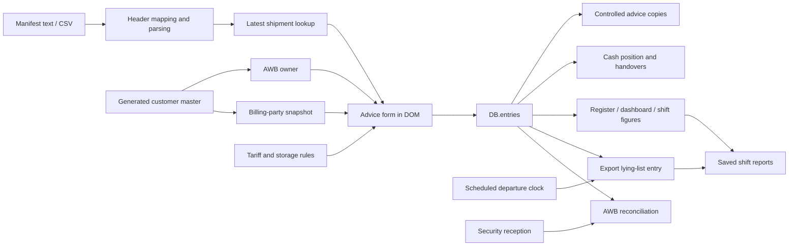

# Domain, data ingestion, and ledger audit

Audit date: 14 September 2026. Scope: the checked-in prototype, its domain documentation, twelve regression specifications, and generated fixtures. No operational customer data was opened. Commercial tariff values are deliberately omitted. References below refer to the legacy application before the revamp.

**Historical baseline review.** The source references identify the [archived application at `f0f0fdb5cc506bfd3dfc0c465395c165c2bae4ce`](https://github.com/nre17/Buddy-Audit/blob/f0f0fdb5cc506bfd3dfc0c465395c165c2bae4ce/app/solitair-invoicing.html#L1), removed from the current working tree after migration. The [revamp index](README.md) and [system map](system-map.md) describe delivered fixes and remaining boundaries; do not treat every baseline finding below as an unresolved current defect.

## Assessment

The valuable asset is the counter workflow and its regression suite: AWB lookup, separate shipment owner and billing party, SHC-based handling and storage, payment allocation, cash reconciliation, controlled printed forms, and operational handover. Preserve these as explicit domain contracts. The application is not yet a general logistics system: there are no shipment milestones independent of invoices, flight records, ULD records, capacity planning, actual departure confirmation, payment settlement ledger, or ERP integration.

The main modernization risk is making a more polished interface around unreliable state transitions. Data validation, durable saves, ingestion provenance, and an immutable financial record need to precede broader automation. The user authorizes moving beyond the previous single-file architecture; this does not supply a new commercial tariff or justify inventing operational rules.

## What exists and how it connects

| Domain object | Baseline representation and owner | Connections and limitations |
|---|---|---|
| Customer master | Embedded `CUSTOMERS`, mirrored in `fixtures/customers.demo.json`; generated fictional records | 1,892 records; both form pickers use this master. Name is the lookup key. `DB.customers` is an unused legacy names mirror. No operational customer import. |
| Shipment lookup | `SH.items`, storage key `solitair_shipments_v1` | One latest row per digit-normalized AWB; flight, route, times, SHC, gross weight, pieces and owner are copied into the advice. No shipment ID, flight instance, row history, or source batch. |
| Advice / invoice | `DB.entries` with `type: invoice` | Captures shipment facts, owner, separate billing-party snapshot, charge lines, total, payment allocation, staff and timestamps. Saving is issuance; there is no persistent draft, void, revision, or settlement lifecycle. |
| Charge catalogue | `EXPORT_LINES` / `IMPORT_LINES`, with `DB.rates` overrides | Form calculations depend on direction, cargo class and event times. Saved lines retain values but lose catalogue IDs, units, rule versions and override provenance. |
| Cash handover | `DB.entries` with `type: handover` | Reduces cash; shares the invoice collection but has a different shape. Date and actual recording timestamp can differ. |
| Opening float | Scalar fields on `DB` | Overwriting the float changes all historical cash calculations; it is not a dated cash transaction. |
| Warehouse lying entry | `LL.items`, `LL.cleared`, `LL.removed`; key `solitair_lying_v1` | Export invoices create `LLA + invoiceId`; manual import and export entries are allowed. Entries clear on scheduled departure time, not an observed cargo movement. |
| Security reception | `DB.sec` | Direction, AWB, receiving section, timestamp and acknowledgement. Reconciliation checks the latest invoice with that AWB, irrespective of direction. |
| Shift report | `DB.reports`; equipment also copied to `DB.equipment` | Stores financial figures and manual operational notes. Reprinted warehouse section reads today's list rather than the saved report state. |
| Site / staff settings | `DB.company`, `DB.bank`, `DB.staffList`, `DB.staff`, `DB.freeHours`, logo | Browser-local mutable configuration; printed historical advice uses current issuer/bank/branding settings. Staff selection is attribution, not authentication. |

The last warehouse-to-report connection is a live dependency during print, not a persisted snapshot. No graph database is needed to make these relationships explicit: stable IDs, foreign keys, and a shipment detail timeline would already provide most of the requested connected operational view.

## Contracts to preserve

1. **Owner versus payer.** `cust` means the AWB owner; operational reports group by it. `billTo`, `billTrn`, `billAddr` mean the invoiced party and are the only customer identity printed. `acct` / `addr` remain compatibility mirrors. Billing is an explicit choice, including “same as owner.” See application lines 2323–2358, 3772–3787, 3867–3877, 4334–4356.
2. **Pricing.** Compute each active line from quantity, rate, minimum and its own VAT flag. Zero quantity does not trigger a minimum. Only positive billed lines persist. Preserve the signed-off catalogue, its cargo classes and optional-line behavior. The formula is duplicated at lines 3725–3744 and 3794–3820.
3. **Cargo classification.** GEN/ELI are general; any perishable code takes precedence; all other tokens, including unknown tokens, are special; an empty code is general. Multiple codes are supported. Dangerous-goods inspection follows presence of DGR, not exact-string equality. See lines 2487–2496.
4. **Storage and late acceptance.** Storage uses elapsed acceptance-to-departure for export, or RCF-to-delivery for import, subtracts class free hours, and rounds positive excess up to complete billable days. Quantity is gross weight times days. Export late acceptance and DG inspection are distinct conditions. See lines 2502–2511, 3556–3593. Rate-sheet compound and tier approximations are already admitted in `docs/03-business-rules.md`; resolve them against the source rate sheet, not assumptions.
5. **Payment.** Blank single-method amount means full charges; explicit zero is meaningful. Cash + Card takes entered amounts. A mismatch requires a reason. The register records allocations and reason; the advice prints full charges and suppresses the mismatch reason. Credit/CASS allocations are not evidence of later settlement. See lines 3747–3755, 3824–3860, 3899–3900, 3936–3950.
6. **Cash.** Opening float plus invoice cash minus handovers. Cash handover cannot exceed the current balance. The same rule should become one shared reporting projection instead of several independent loops. See lines 2572–2580, 4148–4183, 4592–4600, 5201–5248.
7. **Compatibility.** Backfill entry type, legacy billing identity and reception IDs without changing historical amounts or references. Read older field shapes and preserve unknown fields during migration. Current migration entry point is `load()` at lines 2519–2547.
8. **Controlled documents.** Export and import use their existing form codes and copy counts. Preserve document contents separately from the on-screen design. Historical identity and charge data must remain reproducible.

## Baseline ingestion behavior

The importer accepts clipboard tables and CSV/TSV/TXT, not native workbooks. It normalizes heading punctuation/case, maps known aliases, and excludes chargeable/volumetric weight headings. It searches the first five parsed rows for an AWB header. The delimiter, however, comes only from the first nonempty physical line. Quoted cells, doubled quotes and embedded newlines are supported; malformed quoting is not reported. See lines 2671–2725, 2804–2818 and 3256–3262.

AWBs are reduced to digits, with an eight-digit minimum for lookup/import. There is no maximum length, format/check-digit validation, raw-versus-normalized identity validation, or ambiguity record. Duplicate rows silently resolve to the last row with a preview count. Subsequent imports replace all mapped fields for that AWB; blank fields can overwrite complete earlier values. There is no comparison screen or retained previous version. See lines 2620–2633, 2830–2849 and 2858–2873.

Dates accept year-first strings, day/month or month/day strings, Excel serials and AM/PM times. The importer guesses ambiguous date order using date-range spread, then browser locale, and permits a user override. A mixed-order sheet is warned about but can still import with one order for every row. Invalid dates become empty values with a warning. ISO offsets/time-zone suffixes are not interpreted as instants; the parser treats the apparent wall-clock components as local. Missing gross weight remains null, but nonempty invalid numeric content becomes zero. See lines 2733–2853.

Rows retain only the normalized latest values and import timestamp. Parse warnings, raw cells, mapping, chosen date order, original line number, file identity and import actor are discarded. Retention expires rows at the next import after thirty days, measured from last import time rather than operational event time. Reimporting an old shipment refreshes its retention. `SH` is intentionally outside the backup.

For an actual ingestion workbench, use this pipeline:

`source -> import batch -> detected mapping -> typed candidate rows -> issues -> preview diff -> explicit apply -> imported shipment revisions`

Keep source row identity and raw text available in local data, with no operational source files in Git. Classify each issue as blocking, warning or informational. Treat invalid, absent and zero as separate states. Offer explicit numeric/date conventions, direction conflict resolution, duplicate policy, and new/updated/unchanged row counts. Preserve operator edits to an open draft by showing a reconciliation choice when its source shipment changes.

## Verified defects and risks

“Browser reproduced” means isolated generated data in system Chrome through the existing Playwright harness. “Function reproduced” means the actual functions extracted from the checked-in source and executed in Node. “Source confirmed” identifies a reachable code path; it does not claim a full end-to-end reproduction.

| ID | Priority | Finding and evidence | Recommended treatment |
|---|---|---|---|
| D-01 | P0 | **A failed ledger write can be reported as saved.** `save()` catches storage exceptions without returning failure (2518); issuance pushes into memory, calls it, announces success, updates derived lists and resets the form (3963–3979). Source confirmed; also existing A-04. | Return a structured persistence result; commit candidate state only on successful durable write; retain the draft and reference on failure. |
| D-02 | P1 | **Impossible shipment inputs save.** Only truthiness is checked for weight/pieces (3931); date validation checks presence, not chronology (3916–3925). Browser reproduced: negative weight, negative pieces, departure before acceptance all persisted in one invoice. | Shared typed validation for draft, preview, print, import and issuance; positive finite weight, positive integer pieces, valid chronological events. |
| D-03 | P1 | **Reimport leaves open advice stale.** Reimport calls `shRefreshForms()` (2916–2917, 3188–3191), but lookup immediately returns for the same AWB key (3019). Browser reproduced: updated manifest weight changed to 900 while the open advice retained 100. | Track shipment revision and field provenance; present a source-change reconciliation with recalculated charges. Do not blindly overwrite manual work. |
| D-04 | P1 | **Numeric ingestion silently changes meaning.** `num()` strips anything except digits, dot and minus (2364); manifest parsing uses it without warnings (2837–2846). Function reproduced: decimal-comma `1,25` becomes 125, scientific notation `1e3` becomes 13, unreadable weight becomes zero, negative pieces import without warnings. | Strict locale-aware parsers with explicit invalid state and range/integer checks. |
| D-05 | P1 | **Restore is not a validated migration transaction.** Restore checks only truthiness of `entries` (4923–4927), then replaces DB and boots without `load()` migrations. Security restore accepts any array and skips ID migration (5815–5818). Boot overlays rate/company settings onto previous in-memory settings (4983–4988, 6039–6054, 6086–6090), so an older backup omitting an override can retain the previous value until reload. Source confirmed; extends A-21. | One schema-validated, versioned migration pipeline used at boot/import/restore; reset to immutable defaults before applying restored settings; stage and validate before replacing state. |
| D-06 | P1 | **Reference identity is incomplete.** Separate export/import counters are rendered without mode in the reference (2477–2480, 3953–3957), so both modes can issue the same visible reference. No daily reset, uniqueness check, instance identity or multi-tab conflict control exists. | Preserve historical references; define explicit future numbering scope and allocate within the persistence transaction. Never reuse voided numbers. |
| D-07 | P1 | **Backup omits unrecoverable warehouse state.** Main backup exports DB only (4913–4915), omitting LL manual entries, clearance history and removal decisions. SH omission is documented and deliberate. DB and LL writes are separate during save/delete (3970, 4123–4130). Source confirmed. | Versioned backup envelope covering authoritative entities, with an explicit manifest inclusion option; transactional repository boundary and restore preview. |
| D-08 | P1 | **Security can accept the opposite-direction invoice.** Lookup takes only AWB and chooses latest invoice (5911–5921). Both reception render and missing scan accept any match (5843–5852, 5929–5930), although receptions have direction. Source confirmed. | Match shipment identity and direction; distinguish missing, duplicate, voided and mismatched advice states. |
| D-09 | P1 | **Deletion is the correction mechanism.** Invoice deletion removes the record and changes cash history without a void/reversal record (4116–4133). Rates, quantities, minimums and tax flags are editable without an override audit; saved lines lose catalogue identity (3808–3818). | Issued records should be immutable; add reasoned void/reversal and replacement links, tariff version, original/overridden values and actor metadata. |
| D-10 | P2 | **Displayed and saved totals use different rounding stages.** The form sums two-decimal rendered line charges (3762–3769); collection sums unrounded floating-point charges (3800–3820). Fractional custom lines can make displayed subtotal differ from saved/printed subtotal. Source confirmed. | One money calculation module with an explicit line-versus-invoice rounding policy, decimal arithmetic or integer minor units with controlled rate precision. |
| D-11 | P2 | **Adjacent shifts double count their boundary.** The window includes both start and end: earlier records are `< start`, later records are `> end` (5207–5211). A record exactly at a shared boundary is in both reports. Source confirmed. | Use half-open windows `[start, end)` and cover exact boundary/overnight cases. |
| D-12 | P2 | **Historical outputs change on reprint.** Invoice issuer/logo/bank come from current settings (4342–4348, 4393, 4411). Saved reports omit lying-list snapshot (5317–5330) and `printHandover(saved)` calls the current `lyingBand(true)` (5468). Source confirmed. | Persist the required document context and warehouse snapshot; distinguish current payment instructions from historical issued data if the business wants both. |
| D-13 | P2 | **CSV title rows defeat delimiter detection.** Header detection looks through five rows, but delimiter detection uses only the first physical line (2806–2815). Function reproduced: a plain title before a comma-separated AWB header produces “No AWB column”. | Detect delimiter/header jointly across candidate rows with quoting-aware scoring; allow explicit mapping. |
| D-14 | P2 | **Warehouse state is a schedule inference.** Cargo clears when STD passes (5625–5634), even if a flight is delayed. Truncated/cleared history also removes the only AWB deduplication evidence (5607–5609), allowing older invoices to be re-synced later. Source confirmed. | Model planned and actual departure separately; use confirmed milestone events, plus retained projection identity/tombstones. |
| D-15 | P2 | **No auditable storage override exists.** The form permits editing charge inputs but always writes `storageOverride: false` / empty reason (3903–3904). The declared manual storage row is skipped by the form. Source confirmed; existing A-23. | Explicit override command with original calculation, reason, user and resulting amount; preserve legacy behavior until rule approval. |

Additional import risks to test: contradictory departure/RCF/route direction, malformed CSV quoting, duplicate headings, long or alphabet-contaminated AWBs, mixed numeric conventions, gross-weight units, stale open drafts after clearing SH, and row-count limits. The current importer has no request to or dependency on an external system.

## Test and fixture coverage

The twelve specs contain 106 cases. Strong coverage includes all listed SHC classes on both advice modes, storage free periods, conditional fees, billing identity, basic payment exceptions, legacy backfills, local date input, lookup directions and AWB spelling, and routine register/security/lying-list flows. They are a valuable behavioral compatibility harness, not proof that every domain invariant is correct.

Missing or thin areas include persistence failure, malformed restore, partial backup/restore, duplicate issuance, concurrent writers, sequence rollover, negative/fractional/nonfinite quantities, reversed dates, precision boundaries, duplicate invoice direction, exact shift boundaries, source revision reconciliation, saved-report reprint fidelity, and pricing override audit. Existing migration tests seed old shapes before a reload; they do not exercise the restore button. The dashboard/handover suite has four cases and no exact boundary tests.

Fixtures are generated and should remain so. `demo-db.json` contains fourteen invoices and one handover across 5–9 September 2026, with all six payment modes; every invoice still uses the pre-billing-party shape. `demo-lying-list.json` contains two fixed departure dates on 9–10 September, already past at this audit, despite the fixture README saying “next few hours.” Use fixed-clock regression fixtures and separately generated current-time demo scenarios. The fixture is useful migration coverage; do not silently rewrite its legacy shape away.

## Documentation drift

- `docs/02-data-model.md` opens with “Two objects, two keys” although SH makes three; DB reports/equipment and LL removed-state are not fully documented in its initial shapes.
- `docs/07-erp-handover-spec.md` says mismatched payment only warns and proceeds, whereas a reason is now mandatory; says security matches exact MAWB, although digit normalization is implemented; and says imports never appear in the lying list, although manual import entries are supported and tested.
- The existing A-02 sample code still shows a pre-current date helper. Reference daily reset is not the only identity problem: mode scoping and concurrent writers also need decisions.
- Several runbook/governance statements describe operational use while the newer data policy explicitly calls the build a demo prototype. A revamp must state one clear intended operating mode.

## Target boundaries and order

1. **Domain foundation:** pure modules for AWB identity, dates in the configured site zone, customer/billing snapshots, cargo classification, charge evaluation, payment allocation, issuance validation and cash projections. UI consumes results and explanations. Keep the signed-off tariff data separate and private.
2. **Repository and migration boundary:** typed versioned state, atomic commands, failure handling, conflict detection, deterministic legacy import, authoritative backup envelope. Keep local-only deployment possible while making a server repository replaceable later. A multi-user ledger requires server-side transaction and identity enforcement; browser storage alone cannot provide that.
3. **Ingestion workbench:** mapping, parsed candidates, issue review, before/after updates, revision identity, and source-to-field traceability. Customer/flight/ULD inputs become separate adapters only once formats and rules are supplied.
4. **Operational record:** stable shipment and flight-instance IDs, planned/actual milestones, warehouse location/hold/release events, security receipt linkage and ULD membership. Keep invoice issuance separate from physical movement. A shipment timeline then connects operational events, advice, payments and handovers in one view.
5. **Financial integrity:** immutable issuance, void/replacement chain, payment receipts and allocations separate from invoicing, settlement/outstanding projections, immutable shift-close snapshots and document context.
6. **Integration boundary:** explicit ERP export contracts with unique external IDs, schema version, idempotency key, validation report and acknowledgement/retry state. Never infer that a CSV download means the ERP accepted a transaction.

The first implementation should preserve useful existing workflows while delivering a reliable application launch and a testable architecture. Expanding into ULD operations, rate-sheet corrections, accounting settlement, user roles or external integrations needs concrete domain inputs; the audit should make those gaps visible rather than filling them with plausible fictional behavior.

## Integrated updates after the baseline review

The current importer retains row warnings, source-row references and explicit synthetic/manifest source classification; it rejects invalid nonempty numeric/date values and blocks invalid batches. Header detection handles a title before the table. Reimport refreshes source fields that the operator has not edited while retaining manual changes in an open advice.

The original thirty-day shipment eviction has been removed. Older imported AWBs survive later imports regardless of age; an explicit clear removes them, and importing the same AWB replaces its current row. The added domain-integrity regression covers preservation of older records. This prevents silent age-based loss but does not supply immutable import batches, shipment revision history or source-file retention.

The installed workspace adapter now rolls back all in-memory stores and effective settings when local persistence fails or is blocked, using the last locally accepted snapshot. Register, settings and manual warehouse actions guard their continuation on that result; advice and manifest flows preserve their working input on failure. Complete workspace backups include ledger/settings, shipment records and warehouse state. Local acceptance is still followed by an asynchronous disk flush, whose acknowledgement or failure appears in the storage status.

Other integrated controls include positive finite shipment quantities, nonnegative charge/payment values, chronological cargo timestamps, and direction-aware security reconciliation. These updates supersede the corresponding baseline observations above. They do not resolve invoice immutability/reference policy, monetary rounding, historical document context, physical movement evidence, formal acceptance or ULD modeling. See the [current system map](system-map.md) and [remaining work](README.md#prioritized-next-work).
