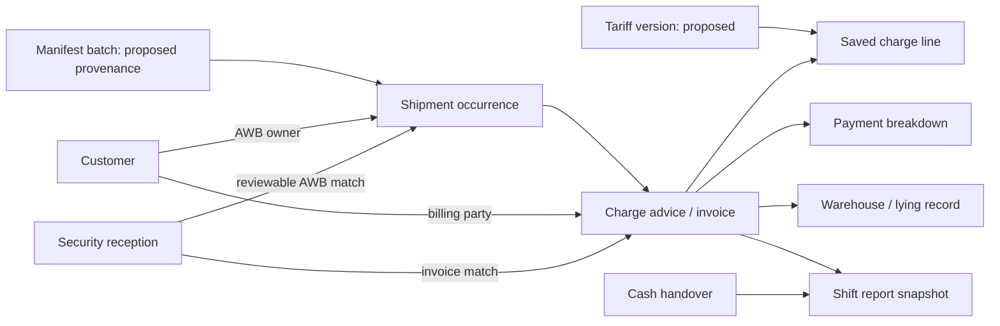

# SolitAir Cargo Workspace — product and design direction

**Review date:** 14 September 2026. **Status:** reference review and proposed product direction; this document does not certify implementation.

The revamp should turn the existing cargo counter tool into a connected operational workspace. The useful model from the user's PMO app is its navigable shell, focused records, contextual actions, explicit source information, and reliable local launch. Cargo operations retain their own vocabulary, commercial rules, and document outputs.

## Reference and evidence

The PMO review was read-only and limited to application code, package scripts, launcher code, and design documentation under `C:/Users/nicholas.elhabr/Documents/ChatGPT/PMO_APP`. No PMO database, client fixture, or saved operational data was opened. No PMO service was launched, stopped, reset, or modified.

Files informing this direction:

| Reference | What it establishes |
| --- | --- |
| PMO `package.json` | React and TypeScript frontend, Vite build, Fastify server, shared validation/data tooling; separate development, build, production, and test commands. |
| PMO `src/App.tsx` | Persistent navigation, page hierarchy, topbar, global search, selected-record dialogs, loading/error states, role preview, current context retained across work views. |
| PMO `src/navigation.ts` | Named routes, query parameters for selected context, validation/defaults, compatibility with earlier URLs. |
| PMO `src/ui.tsx` | Shared fields, labelled status badges, empty states, focus-contained dialogs, date formatting. |
| PMO `src/workspace.css` | Readable typography, restrained surfaces, navigation hierarchy, compact tables, explicit design tokens. This stylesheet overrides earlier base styles; its light sidebar differs from the dark rail described in PMO `DESIGN.md`. |
| PMO `Open Demo.cmd`, `Open PMO.cmd`, `scripts/open-hub.ps1`, `docs/OPENING.md` | Runtime discovery, build when absent, background server, readiness checks, reuse of verified existing server, browser launch, separate data profiles, retained startup logs. |
| [Cargo HTML at the reviewed baseline](https://github.com/nre17/Buddy-Audit/blob/f0f0fdb5cc506bfd3dfc0c465395c165c2bae4ce/app/solitair-invoicing.html#L1) | Ten original working destinations; form builders, tariffs, import parsing, local state, security reconciliation, printed documents. The file has since been removed from the working tree after module migration. |
| Cargo `docs/02-data-model.md`, `docs/03-business-rules.md`, `docs/07-erp-handover-spec.md` | Current records, financial rules, provenance gaps, operational scope and previously identified ERP needs. |

The historical cargo instruction to keep one file describes the previous deployment constraint. The user's current instruction explicitly authorizes a modular application revamp. Preserve the useful business behavior while changing that packaging.

## Observed scope and proposed scope

| Area | Evidenced today | Proposed extension, requiring a defined model |
| --- | --- | --- |
| Shipments | Manifest paste/upload, column and date interpretation, AWB lookup, import/export direction, basic shipment details. | Import batches with immutable raw rows, review decisions, corrections and links to their resulting shipment versions. |
| Acceptance | Export acceptance timestamp, acceptance-related charges, and manual pending-acceptance counts in shift reporting. | Formal acceptance checks, outcome/evidence, discrepancies, responsible operator and controlled transitions. |
| ULD | No structured ULD inventory, ULD build-up, or shipment-to-ULD relationship found in the inspected model. | ULD identifier/type, condition/ownership, capacity rules, build-up/breakdown and allocation history. Do not show invented ULD KPIs. |
| Pricing | Existing export/import tariff catalogues, rate overrides, minimums, per-line tax flags, SHC and elapsed-time calculations. | Effective-dated tariff versions, override reasons and actor history. Contract pricing and market-rate intelligence are separate future requirements. |
| Financial records | Advice invoices, payment breakdowns, register, cash handovers, shift reports, CSV/XLSX output, printable advice. | Durable transactional service, stable audit history, invoice corrections/voids and allocation records. Existing status labels must keep their actual meaning. |
| Warehouse | Export-derived lying list, manual entries, departure-based clearing/history. | Explicit observed movement events, location and hold reasons. A scheduled departure alone must not be presented as verified physical movement. |
| Security | AWB reception log, invoice matching, acknowledgements and missing-invoice alerts. | Direction-aware canonical matching and resolution history. This is invoice reconciliation, not a certified physical release or screening decision. |
| Intelligence | Deterministic calculations and filtered summaries. | Explainable exception ranking after data contracts are sound. Suggestions must show the underlying records and must not silently issue invoices or mark acceptance complete. |

Terms such as “accepted”, “released”, “screened”, “departed” and “paid” must be backed by the corresponding stored fact. Missing information remains visible as missing. A successful manifest import does not establish physical receipt or acceptance.

## Experience principles

1. **AWB is the operational entry point.** Search a shipment once and keep its direction, customer, invoices and warehouse context available through the workflow.
2. **Explain each operational number.** A count opens the records it counts. A charge opens its inputs, rule, quantity, minimum and tax flag. A figure must state its date range and basis.
3. **Separate source facts from decisions.** Manifest text, normalized values, later corrections and staff actions have distinct identities. A parser's inferred date format is a reviewable assumption.
4. **Keep counter work fast.** One primary action per working view; keyboard-friendly entry; stable table rows; selected context retained when navigating back.
5. **Use progressive detail.** The opening view is a concise work surface. Long forms, optional charges, import mappings and document previews appear only when relevant.
6. **Make the local mode plain.** A local demo, a local operational workspace and a shared deployment must not look interchangeable. Display mode and persistence status in a quiet, persistent location.

## Navigation and screen hierarchy

A persistent left rail replaces the ten equally weighted header tabs. The topbar provides current location, global AWB/customer/invoice search, selected staff, and the primary action when relevant. The header cash figure links directly to the cash ledger and states its balance basis.

| Group | Destination | First view | Existing functions retained |
| --- | --- | --- | --- |
| Operate | Overview | Current work needing action, limited operational totals, quick start. | Dashboard and links to existing operating views. |
| Operate | Shipments | Searchable shipment rows with direction, flight, pieces/weight and source. | Shipment Database and manifest intake. |
| Operate | Charge advice | Export/import choice, AWB lookup, working form and charge summary. | Both advice forms, optional charges, preview, save and print. |
| Operate | Warehouse | Active lying list with departure/time context and cleared history. | Lying List including manual entries. |
| Operate | Facility security | Received AWBs, invoice match state and exceptions. | Reception logging, lookup, scanning and acknowledgements. |
| Reconcile | Invoice register | Ledger with filters and record detail. | Invoice/payment rows, hard-copy flag, CSV/XLSX and cash handover. |
| Reconcile | Shift handover | Shift window, derived totals, recorded counts and equipment. | Current and saved shift reports, print output. |
| Manage | Customers | Customer lookup and billing details. | Customer Database, owner/billing-party selection. |
| Manage | Rates & settings | Tariff catalogue first; separate settings sections. | Rates, SHC/free hours, staff, company/bank setup, logo, backup/restore. |

Do not make a new unimplemented feature appear as a clickable destination. Longer-term acceptance and ULD workflows can join Operate when their record contracts and complete workflows exist.

### Overview

Use a compact heading such as **Cargo operations**, with the selected period underneath. Put **New charge advice** and **Import manifest** at the top. Show at most four meaningful headline figures before the work list: invoiced amount for the period, active warehouse rows, unacknowledged security rows without a matched invoice, and cash on hand. Each figure has a definition and navigable source list.

Show “Needs attention” only for conditions that the current records establish. Candidate rows include received AWBs without invoices, near-departure warehouse rows based on scheduled time, or importer validation failures once import batch history exists. Do not sum unlike counts into a fabricated readiness percentage. An empty operational workspace should explain how to begin; a demonstration must be visibly labelled and use synthetic records.

### Shipment workspace

Keep a searchable list and open a shipment detail panel without destroying filters. The detail begins with AWB, direction, flight and route, then exposes shipment facts, charge advice/invoices and warehouse/security links. Show the original manifest values and source batch when provenance exists. Display the AWB owner and billing party as different fields.

The current store holds one shipment per normalized AWB and later imports can replace it. The future model must decide how AWB reuse, direction, date and versioning identify a shipment occurrence before introducing a durable lifecycle timeline. In the interim, links must reflect actual matches and show ambiguity instead of choosing silently.

### Charge advice

Use one shared form implementation parameterized by direction; keep export/import labels and required timestamps explicit.

1. Search or enter AWB. Show lookup result and direction before filling fields. If no match exists, allow the existing manual workflow with a clear source label.
2. Review shipment facts. Export uses acceptance and scheduled departure; import uses RCF and delivery. Display dates day-first and times in 24-hour notation.
3. Select billing party separately from the operational AWB owner. Retain customer TRN/address behavior.
4. Review a short table of active charges. Optional tariff charges are searchable; omitted lines do not dominate the form.
5. Enter payment allocation. Show billed amount, allocated amount and remaining difference together. Preserve the current supported modes and their validation rules.
6. Review and save. Show reference, record status and next actions only after persistence succeeds. Preview and print must use the same calculation result as saving.

Place a sticky summary beside the working form on wide screens: subtotal, tax, total, payment allocation and save/preview actions. On narrow screens it becomes an in-flow panel; it must not cover the final form rows or keyboard focus.

Expose the explanation of auto-charges inline: cargo class, applicable free hours, elapsed hours, chargeable days, quantity and minimum. Retain the dangerous-goods inspection override as an explicit choice. Do not change tariff rates or tax flags as a side effect of visual modernization.

### Manifest intake

Use a staged interaction: **Choose file / paste → Review interpretation → Validate rows → Import → Results**. A review table needs original value, interpreted value and issue/reason. Date-format overrides are visible before committing. Deduplication and replacement behavior must be summarized. A row with uncertain data is not silently described as correct because it parsed.

The current system supports delimiter/header/date interpretation and preview. Immutable import-batch history and provenance are proposed enhancements, not assumed existing functionality.

### Register, warehouse, security and handover

- **Invoice register:** default columns are date, reference, AWB/direction, billing/operational party, total, payment mode and actions. Payment breakdown and detailed fields move into the record panel or optional columns. Preserve download and print paths.
- **Warehouse:** keep clear distinctions between active and cleared records, manual and invoice-derived entries, and scheduled versus observed events. Add countdown text only when a valid scheduled timestamp exists.
- **Security:** present “Invoice matched”, “No matching invoice” and “Acknowledged” as separate facts. Acknowledging an exception does not create an invoice.
- **Shift handover:** visually distinguish calculated ledger values from operator-entered counts and equipment condition. A saved report is a named snapshot with its shift window; browsing it must not silently recalculate its historical narrative.
- **Settings:** separate rates, company details, people and data management into sections. Restore/import actions need a concrete preview of affected records before replacement. Demo reset must be a distinct action, never part of ordinary startup.

## Visual system

The proposed direction is an aviation operations desk: midnight navigation, warm white working surfaces, restrained emerald accents, tabular figures, and a clear hierarchy. PMO contributes layout and interaction patterns; its consulting branding and purple identity are not copied.

These are proposed working tokens, not an assertion of an approved SolitAir brand kit:

| Token | Value | Use |
| --- | --- | --- |
| `--nav` | `#102C30` | Deep rail and brand area. |
| `--nav-muted` | `#ADC1BE` | Secondary navigation copy on the rail. |
| `--canvas` | `#F3F6F4` | Main background. |
| `--surface` | `#FFFFFF` | Tables, panels and forms. |
| `--surface-subtle` | `#F8FAF9` | Table headings and grouped fields. |
| `--ink` | `#173A3B` | Main text. |
| `--muted` | `#5D706E` | Secondary text; verify contrast at rendered sizes. |
| `--border` | `#DCE6E2` | Quiet separators. |
| `--primary` | `#087F67` | Main action and active selection. |
| `--primary-hover` | `#066752` | Hover/pressed emphasis. |
| `--accent-soft` | `#E2F4EC` | Selected/linked context. |
| `--success` | `#196D46` | Recorded success, with a text label. |
| `--warning` | `#8D5D16` | Attention, with a text label. |
| `--danger` | `#B33638` | Error/destructive action, with a text label. |
| `--info` | `#285B91` | Informational or import/export context. |

Use one local or system sans-serif font with 14–15px body text; Atkinson Hyperlegible Next is a useful reference if bundled. Use tabular numerals and a local/system monospace face for AWBs, invoice references and financial amounts. Avoid tiny all-caps form labels. Page titles can be 28–32px; section headings 16–18px; secondary table text should normally remain at least 12–13px.

Layout targets: 232–248px rail, 60–68px topbar, 24–32px desktop content padding, 16–24px panel padding, 40–44px standard controls, 44–52px table rows, 8–12px control/panel radii. Compact row density can be offered later if it preserves readability. Use a small set of spacing increments: 4, 8, 12, 16, 24 and 32px.

Use limited shadows for popovers or detached detail surfaces. Avoid decorative gradients, giant welcome banners and chart panels that push actual work below the fold. Currency labels are explicit (`AED`); financial values align right. Direction/status badges carry words, never color alone.

## Responsive and accessible behavior

- At laptop width, rail and main content remain visible. Tables scroll within their own region rather than making the whole page horizontally overflow.
- At narrower tablet widths, collapse navigation to a labelled drawer and stack working form/summary panels. Keep access to every destination.
- Preserve browser back/forward and refresh for named destinations and selected records.
- Provide a skip link, visible keyboard focus, associated field labels, logical tab order and explicit validation messages. Dialogs trap focus and return it to the initiating control.
- Errors explain the failed operation and whether saved data changed. Loading states do not imply an empty database.
- Status changes are announced through a polite live region; destructive/errors use an appropriate alert. Respect reduced-motion preferences.
- Print output remains a document layout, with A4 sizing, copy labels and existing commercial fields. UI redesign alone must not rewrite document requirements.

## Modular application and local launch

The long-term structure should separate the shell, feature views, domain calculations and persistence. A staged transition may keep the legacy behavior inside a compatibility boundary, but this is a migration step and must be labelled as such in the implementation record.

```text
src/
  app/                 shell, navigation, application bootstrap
  components/          fields, dialogs, tables, badges, notices
  features/
    overview/          derived operational views
    shipments/         list, detail, manifest intake
    advice/            shared export/import workflow
    register/          invoice and cash ledger views
    warehouse/         active and cleared cargo
    security/          reception and invoice matching
    handover/          shift workspace and report snapshots
    customers/         master lookup and party selection
    settings/          tariff and workspace configuration
  domain/              charges, money, dates, AWB normalization, selectors
  data/                persistence interfaces, validation and migrations
  styles/              tokens, foundation and feature styles
server/                optional local API and durable store when implemented
shared/                contracts shared by client and server when implemented
scripts/               start/build/open helpers
tests/                 domain and complete user workflow checks
docs/revamp/           audit, mapping and migration decisions
```

The existence of folders alone does not establish a full rewrite. A complete modular implementation means its domain rules can be checked without a browser, its persistence contract is explicit, and its features do not depend on hidden DOM fields in unrelated screens. React/Vite is a sensible route to the PMO-style architecture; a static bundled frontend is also a valid first stage if its local persistence limitations are stated. Do not add a server merely to make the folder tree appear larger.

Provide a clearly named Windows launcher such as `Open SolitAir.cmd`. It should:

1. Resolve the repository root from its own location and find the required runtime.
2. Report missing prerequisites clearly; use a documented package command for installation/build.
3. Build the app when required, including when source has changed, using a lockfile for repeatable installs.
4. Start the intended local service on loopback and verify application identity/readiness before opening the browser.
5. Reuse only a verified compatible instance; surface an occupied port without stopping unrelated processes.
6. Keep normal startup non-destructive. Demo data, imported records, backups and working data must have explicit lifecycles.
7. Preserve useful diagnostics and show the actual URL. A localhost link is a local running app, not a deployed shared service.

Do not mechanically copy the PMO launcher's environment-specific fixture paths, ports, database locks or demo profile naming. Its current `Open Demo.cmd` opens a private review profile, which is not suitable cargo seed behavior.

## Record connections and the knowledge graph

The practical graph begins with stable identities and explainable joins, not a decorative network view:



Current relationships often use AWB strings and invoice IDs rather than formal foreign keys. Payment breakdowns are embedded in invoices; they are not currently separate payment transaction records. Shipment occurrence identities, batch provenance and tariff versions are proposals. Model and migrate these deliberately before claiming end-to-end traceability.

The first visible graph interaction should be **Related records** on an AWB detail: source, invoices, charge basis, warehouse entry, security receptions and relevant handovers. Every relationship should state why it exists. A later network visualization is useful only after those links can be trusted.

## Acceptance criteria for the first delivered revamp

- One documented command and one Windows launcher open the current app in a browser; re-opening behaves predictably.
- Every existing destination and its working actions remain reachable through the new hierarchy.
- AWB-first entry, direction guards, separate billing party, exact charge/minimum/tax behavior, payment validation, print and export behavior are verified with meaningful existing/regression scenarios.
- Customer and shipment source data remain separate from runtime application code where the chosen migration stage permits it.
- A demo uses synthetic data and clearly identifies its mode; zero-state operational data remains a legitimate state.
- The overview counts resolve to the records they count, with date windows and limitations stated.
- Navigation survives refresh and browser history; forms and table actions remain usable at representative laptop and tablet widths.
- Visible controls work, errors are recoverable, and unimplemented ULD/formal-acceptance capabilities are not presented as delivered.
- The implementation report identifies which layers were migrated and which still rely on the legacy engine or local browser storage.
