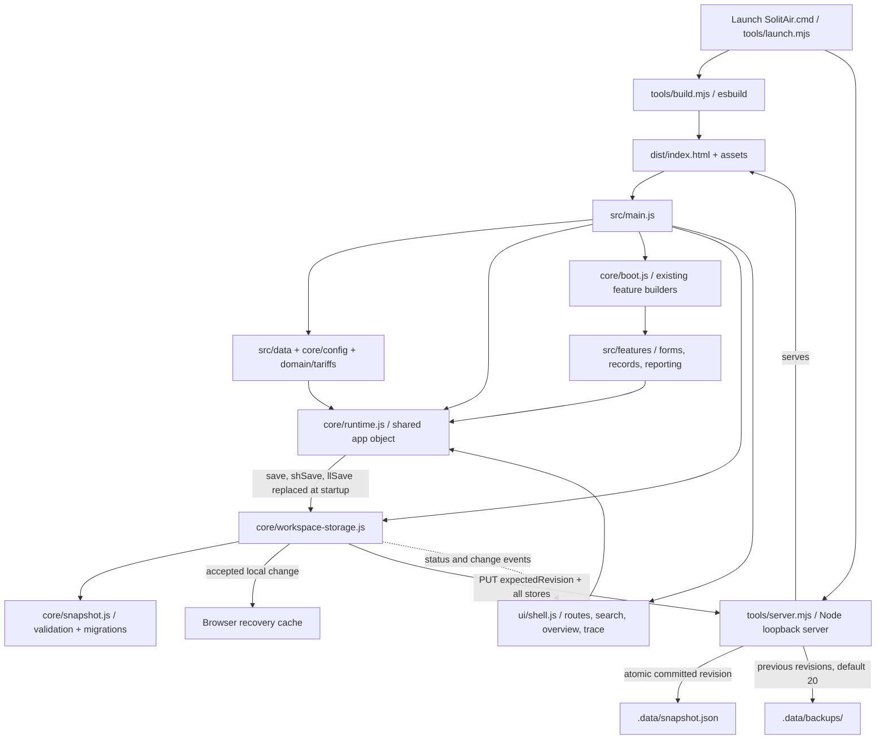
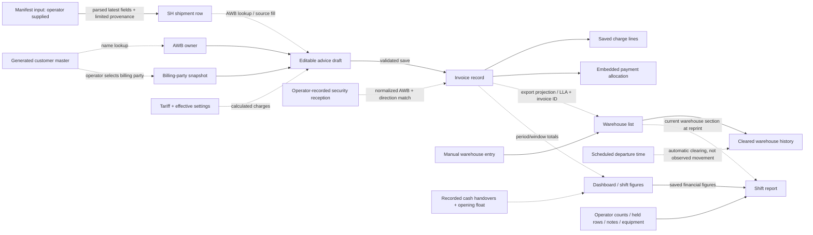

# System, workflow and record map

**Integrated source:** `audit/full-repo-review` · **original baseline:** `f0f0fdb` · **map date:** 14 September 2026.

This map describes the delivered ESM application and its transitional boundaries. Use [the revamp index](README.md) for review order, running instructions and prioritized next work. The [architecture](architecture-audit.md), [domain](domain-audit.md), and [product](product-design.md) reviews provide the supporting baseline evidence.

## Module and dependency map



The diagram shows dependency/data flow, not separate deployed services. There is one browser application and one local server. The server persists a validated JSON envelope; it does not calculate charges or authorize individual business commands.

| Boundary | Current files | Responsibility / important coupling |
| --- | --- | --- |
| Entry and build | `src/index.html`, `src/main.js`, `tools/build.mjs` | Imports/registers features, installs persistence, boots forms, mounts the shell and marks readiness. Bundles JavaScript/CSS into `dist/`. |
| Runtime and initial values | `src/core/runtime.js`, `state.js`, `config.js`, `utilities.js` | Shared mutable `app` namespace, initial DB/settings, formatting, date/numeric helpers and common calculations. |
| Persistence and migrations | `src/core/workspace-storage.js`, `snapshot.js` | Single installed all-store load/save authority, browser recovery cache, workspace identity, revision handling, validation and migrations. Obsolete duplicate persistence code has been removed. |
| Boot | `src/core/boot.js` | Eagerly builds the ten legacy feature pages and wires existing keyboard/tab behavior. Rebuilding a feature replaces its DOM and listeners. |
| Workspace shell | `src/ui/shell.js`, `src/styles/workspace.css` | Overview, grouped route navigation, search, details, source labels, AWB relationships and responsive screen styling. Retains hidden original tab buttons for existing handlers/tests. |
| Shared dialogs and base styles | `src/ui/dialogs.js`, `src/styles/base.css` | Existing modal/toast/document styling; the new shell uses native dialogs for search/detail. Print rules stay distinct from the screen shell. |
| Shipment/customer intake | `src/features/shipments.js`, `customers.js` | Manifest parser/preview/import, latest AWB lookup, source-change reconciliation and generated-master lookup. |
| Advice and commercial rules | `src/features/advice.js`, `src/domain/tariffs.js` | Shared direction-dependent forms, input validation, auto/optional charges, allocation, preview/save. Rules still depend on DOM fields and shared runtime values. |
| Invoice/cash/reporting | `src/features/register.js`, `dashboard.js`, `handover.js` | Ledger filters/actions, cash projections, dashboard summaries and recorded shift reports. Several projections remain independently computed. |
| Operational lists | `src/features/warehouse.js`, `security.js` | Invoice-derived/manual lying entries; reception log and invoice reconciliation. Scheduled clearing remains separate from proof of actual movement. |
| Output and settings | `src/features/printing.js`, `exports.js`, `settings.js` | Advice/report documents, CSV/XLSX, tariffs/settings, whole-workspace backup/restore. |
| Source assets/scenarios | `src/data/customers.js`, `branding.js`, `demo.js`, `fixtures/` | Customer fixture imported once as the canonical master, branding asset and synthetic scenario helpers. The generated customer list is not duplicated in workspace snapshots. |
| Local runtime | `tools/server.mjs`, `tools/launch.mjs`, `Launch SolitAir.cmd` | Loopback HTTP/API, snapshot storage and ownership, build/start/reuse checks, browser launch. |

**Transitional boundary:** this is modular JavaScript, not React/TypeScript. Modules register `app.function` and `app.store` members, and call one another through that namespace. `src/main.js` exposes compatibility getters on `window` for the existing tests, plus `window.SolitAir`. Explicit imports make the dependency visible, but they do not yet enforce pure services, immutable state or isolated component ownership. The next extraction should separate domain inputs/results from DOM rendering and replace the compatibility bridge only after the affected behavior is covered.

## Save, restore and restart semantics

The active envelope is:

```text
format: solitair-workspace
version: 1
exportedAt: ISO timestamp
db: ledger + settings + receptions + saved reports/equipment
shipments: latest loaded shipment records
warehouse: active + cleared + removed identities
```

The browser normally caches `{workspace, revision, pending, snapshot}` under `solitair_workspace_v2`. It verifies the server's application/workspace identity through `/api/health` before using pending recovery data. The explicitly selected browser sandbox uses `solitair_workspace_sandbox_v2` and does not read or overwrite the normal disk-workspace recovery cache or submit disk writes. Legacy browser keys are read for migration when applicable; the active save path is the unified envelope.

1. Startup fetches `GET /api/health` and `GET /api/snapshot`, verifies workspace identity, validates the revision/envelope and migrates records. Pending recovery belonging to another or unidentified workspace is not applied. If the pending content already matches the committed disk snapshot, the lost acknowledgement can be reconciled; differing newer disk content pauses saving and retains the browser recovery copy.
2. A feature mutation passes through `app.save`, `app.shSave` or `app.llSave`, all installed as the same snapshot persistence adapter. Validation and the browser-cache write occur before that call reports local acceptance. Failed or blocked persistence restores `DB`, `SH`, `LL` and effective configuration to the last locally accepted snapshot; guarded register/settings/manual-warehouse actions return without a success continuation. Advice/manifest callers retain their draft or import input.
3. Normal disk mode queues an asynchronous `PUT /api/snapshot` carrying `expectedRevision`. The server serializes writers, validates bounded JSON, writes/syncs a temporary file and atomically replaces the committed snapshot. Successful responses advance the revision.
4. A stale revision returns a conflict. A failed disk write does not advance the committed revision. The browser retains pending data and exposes recovery/retry status; the save banner distinguishes local acceptance from disk acknowledgement.
5. Before replacement, the prior committed revision is retained in `.data/backups/`. The default retention is twenty previous revisions, using only the server's own backup filename pattern. This is local recovery, not independent/off-site backup.
6. Restore previews collection counts, validates and migrates the candidate envelope, then applies it through the same persistence boundary. Legacy register-only backups produce explicitly empty missing stores; unavailable history is not reconstructed.

The server holds a per-data-directory process lock, identifies the application/workspace through `/api/health`, protects the served directory from traversal and data-file exposure, and refuses corrupt stored snapshots rather than silently replacing them. `SOLITAIR_PORT` and `SOLITAIR_DATA_DIR` select the local port/store. The browser status and server revision are authoritative for save progress; an invoice success toast alone is not proof of a completed disk flush.

## Exact current record families

| Record family | Location / identity | Recorded facts versus derived meaning |
| --- | --- | --- |
| Customer master | `app.CUSTOMERS`; canonical source `fixtures/customers.demo.json`; customer `no` and name | Generated demonstration reference data with billing fields. Runtime billing lookups still use names; no authoritative customer integration or managed master-data lifecycle exists. |
| Shipment lookup row | `app.SH.items[]`; normalized `key` derived from `awb` | Latest route, flight, `dep`/`rcf`, SHC, nature, pieces, gross weight, owner and import time. `source`, `sourceRow`, `warn` preserve limited provenance. One current row per AWB key; same-AWB imports replace that row. Older AWBs remain until explicit clearing, with no age-based eviction. No stable shipment-occurrence or revision chain. Direction is derived from timestamps/route. |
| Advice draft | Export/import form DOM | Source-filled fields plus editable owner/billing party, timestamps, charges and allocations. Draft is not a separately persisted entity. |
| Invoice | `app.DB.entries[]` with `type: invoice`, stable `id`, visible `ref` | Direction, source/shipment fields, AWB owner, billing-party snapshot, timestamps, saved charged lines, total, allocation and staff label. Visible reference policy is distinct from stable row identity. |
| Charge line | `invoice.items[]` | Saved description, quantity, rate, minimum, tax flag and calculated values; no durable catalogue/version/override command identity. Zero billed lines are omitted. |
| Payment allocation | `invoice.pay` and `payMode`, `txn`, `payReason` | Amounts recorded against the invoice. Not separate bank/card transactions, settlement evidence, receipts or an accounts-receivable ledger. Credit/CASS allocations do not prove later payment. |
| Cash handover | `app.DB.entries[]` with `type: handover` and `id` | Amount, staff, note, date and recording timestamp. Reduces calculated cash. |
| Opening float | `app.DB.openingBalance`, `openingDate`, `openingNote` | Mutable opening configuration used in cash projections; not an immutable dated cash event. |
| Warehouse entry | `app.LL.items[]` / `cleared[]`; manual ID or `LLA` + invoice ID | Manual fields or export-invoice projection: AWB, direction/location text, pieces/weight, flight, scheduled departure and source metadata. Clearing follows the scheduled timestamp; it does not establish observed departure. |
| Removal marker | `app.LL.removed[]` | Retains removed automatic entry identities to suppress immediate re-creation. Not a full operational or deletion audit log. |
| Reception | `app.DB.sec[]`, stable `id` | AWB, direction, receiving section, timestamp and acknowledgement. Invoice matching is a reconciliation result; acknowledgement is a separate operator action. |
| Shift report | `app.DB.reports[]`, `id`; current equipment in `app.DB.equipment` | Window/people, captured financial figures, manually entered operational counts, notes/held entries and equipment. Some reprint context remains live, so it is not yet a fully immutable issued document. |
| Workspace configuration | `app.DB.company`, `bank`, `logo`, `staffList`, `staff`, `rates`, `freeHours`, `seq` | Mutable local settings and counters. A selected staff name is not an authenticated identity. Defaults plus saved overrides determine effective configuration. |

## AWB relationship graph

Solid arrows below mean a recorded containment/reference or deliberate operator input. Dotted arrows mean a calculation, inferred classification or lookup. A matching AWB is useful evidence of association; it is not a foreign key proving that two reused numbers identify the same shipment occurrence.



The shell exposes this association as **The AWB trail**: manifest details, matching invoices, warehouse entries, and reception counts. Its invoice/reception detail links use normalized AWB and known direction. Warehouse matching is currently by AWB. Unknown source labels remain unclassified; only explicitly marked synthetic rows receive a synthetic label. The overview reports current saved collections with an all-dates basis; it does not invent a live feed, acceptance percentage, verified physical-stock total or ULD count.

## Baseline-to-current coverage map

All **41 baseline tracked files** are accounted for below, grouped by role. This is a migration coverage map, not a second file dump. Use `git ls-tree -r --name-only f0f0fdb` for the exact baseline inventory and Git history for the untouched original application. New source paths are the implementation locations; older numbered documents remain valuable historical/domain references where their deployment statements have been superseded.

| Baseline files | Count | Current role / new implementation destination |
| --- | ---: | --- |
| `.gitattributes`, `.gitignore` | 2 | Line-ending and generated/private-artifact boundaries; must cover `dist/`, `.data/`, dependency output and backup families. |
| `.github/pull_request_template.md`, `.github/workflows/ci.yml` | 2 | Review checklist and integrated build/data-guard/test pipeline. |
| `package.json` | 1 | Runtime/dependency/script entry point; paired with the selected committed lockfile. |
| `README.md`, `CLAUDE.md`, `CONTRIBUTING.md`, `CHANGELOG.md` | 4 | Start/run guidance, agent rules, contribution workflow and release history. Current module/deployment facts live in root guidance plus this revamp index. |
| [Original `app/solitair-invoicing.html`](https://github.com/nre17/Buddy-Audit/blob/f0f0fdb5cc506bfd3dfc0c465395c165c2bae4ce/app/solitair-invoicing.html#L1) | 1 | Removed baseline monolith, recoverable at the linked Git commit; executable source now split across `src/index.html`, `core/`, `features/`, `domain/`, `data/`, `ui/`, and `styles/`. The one-time extraction tool and its dependencies are no longer needed. |
| `docs/README.md`, `docs/01-architecture.md`, `docs/04-code-map.md` | 3 | Original architecture navigation; this system map supplies current module paths and storage flow. |
| `docs/02-data-model.md`, `docs/03-business-rules.md` | 2 | Legacy field/commercial contracts; current records in this map, rule data in `domain/tariffs.js`, validation in `features/advice.js` and `core/snapshot.js`. |
| `docs/05-audit-findings.md`, `docs/07-erp-handover-spec.md` | 2 | Historical defects and ERP intent; cross-check the new architecture/domain audits and prioritized remaining work. |
| `docs/06-operations-runbook.md`, `docs/08-data-protection.md`, `docs/09-governance.md` | 3 | Operational/privacy/governance background; current startup/recovery is `tools/launch.mjs`, `tools/server.mjs`, `core/workspace-storage.js` and root guidance. |
| `fixtures/README.md`, `fixtures/customers.demo.json`, `fixtures/demo-db.json`, `fixtures/demo-lying-list.json` | 4 | Synthetic master and legacy migration fixtures. `src/data/customers.js` imports the canonical customer JSON; current-time scenario helpers live in `src/data/demo.js` and `features/shipments.js`. |
| `tests/README.md`, `tests/harness.js`, `tests/run-all.js` | 3 | Compatibility runner/harness, now exercising the built HTTP app in an isolated browser sandbox. |
| `tests/specs/01-boot.spec.js`, `02-advice-form.spec.js` | 2 | Bootstrap and advice workflow contracts → `core/boot.js`, `ui/shell.js`, `features/advice.js`. |
| `tests/specs/03-charges.spec.js`, `04-payments.spec.js` | 2 | Commercial behavior → `domain/tariffs.js`, `features/advice.js`. |
| `tests/specs/05-register-cash.spec.js` | 1 | Ledger/cash → `features/register.js`, `ui/dialogs.js`, reporting projections. |
| `tests/specs/06-lying-list.spec.js`, `07-security.spec.js` | 2 | Operational list/reception → `features/warehouse.js`, `security.js`. |
| `tests/specs/08-dashboard-handover.spec.js` | 1 | Reporting → `features/dashboard.js`, `handover.js`. |
| `tests/specs/09-migrations.spec.js` | 1 | Legacy record compatibility → `core/snapshot.js`, `workspace-storage.js`. |
| `tests/specs/10-awb-first.spec.js`, `11-customer-database.spec.js`, `12-uae-dates.spec.js` | 3 | Intake, billing identity and dates → `features/shipments.js`, `customers.js`, `advice.js`, `core/utilities.js`. |
| `tools/generate-customers.py`, `tools/pii-scan.js` | 2 | Reproducible synthetic master and tracked-source data guard. |
| **Total baseline coverage** | **41** | New build/server/launcher, shell and persistence/domain-integrity tests extend this baseline. |

New checks are concentrated in `tests/server.test.js` and browser specs `13-workspace.spec.js`, `14-domain-integrity.spec.js`, `15-workspace-storage.spec.js` and `16-security-boundaries.spec.js`. They cover connected navigation/search, domain/ingestion failures, whole-workspace restore, disk conflicts and recovery, sandbox/workspace identity separation, reception reconciliation/mutations and rendering/export safety. The server suite currently passes **13/13**; final integrated browser totals belong in [the validation record](README.md#validation-record). These checks do not imply that every future operational control exists.

## Boundaries before the next expansion

- **Formal acceptance:** timestamps, charges and manual pending counts exist. There is no acceptance checklist/evidence/decision entity.
- **ULD:** no ULD inventory, capacity/condition model, ownership or shipment allocation lifecycle exists.
- **Physical movement:** scheduled warehouse clearing and invoice status are not observed receipt, screening, loading, departure or release evidence.
- **ERP:** downloaded CSV/XLSX and the historical specification are not a connected ERP integration or acknowledgement of posting.
- **Users/customer master:** generated master and staff dropdown remain local prototype mechanisms; no corporate sign-in, role enforcement or authoritative customer synchronization is delivered.
- **Financial lifecycle:** invoices embed allocations; deletion and mutable settings still exist. There is no complete issue/void/correct/settle/reverse lifecycle with an append-only audit trail.
- **Traceability:** warning/source-row metadata and the AWB trail improve inspection. Raw-file retention, import versions, tariff versions, stable shipment occurrences and durable relationship history remain future work.

These boundaries determine the next data contracts and acceptance tests. They should be resolved with concrete source examples and operational rules before adding new status labels, dashboards or integrations.
