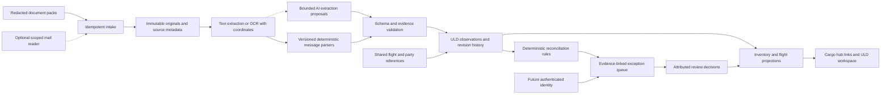

# ULD reconciliation: exploration and pilot proposal

**Status:** research and design only, 14 September 2026. No mailbox was accessed, no email address or operational document set was supplied, and no connector, monitoring job or autonomous workflow was activated. This proposal does not change the cargo application or its operational records.

## Recommendation

Build a small ULD reconciliation workbench as a separate domain module, with an independent evidence store and a service boundary that can later be deployed separately. Share stable flight references and authenticated identity with the cargo workspace when those foundations exist. Start with uploaded, redacted flight document packs; evaluate before connecting a mailbox.

The useful product is a traceable answer to **which identified units disagree, for which flight leg and document revision, and what evidence resolves the disagreement**. Counting ULD-looking strings across three documents is insufficient. No evidence currently supports a promise of 100% extraction accuracy, complete physical inventory, or unattended exception resolution.

The [current system map](../revamp/system-map.md) describes a local cargo application with shared mutable runtime state and JSON snapshots. It does not provide a flight-instance master, ULD lifecycle, authenticated users or an email intake service. The staff selector is attribution, not authentication. Do not add ULD inventory as another invoice-derived list or infer actual movements from scheduled departure times.

## What the messages mean

| Record | Verified meaning and purpose | Reconciliation implication |
| --- | --- | --- |
| **LIR — Loading Instruction/Report** | Loading instructions become a report when the loading supervisor confirms actual loading; deviations must be reflected. The instructions concern distribution and loading constraints. [IATA IRM, edition 14](https://www.iata.org/en/iata-repository/publications/iosa-audit-documentation/iata-reference-manual-irm-ed-14) | Distinguish a plan, revised instructions and the final signed report. A preliminary LIR is not interchangeable with confirmed loading. |
| **UCM — ULD Control Message** | Unilode's published profile uses IN/OUT messages for arriving/departing flights and trucks. Its UCM OUT example includes unit identities, destinations and commodity codes; its legend distinguishes empty and unserviceable units. [Unilode UHM, revision 10, pp. 4 and 20](https://www.unilode.com/wp-content/uploads/2025/08/Unilode-UHM-2024-V10-1.pdf) | Interpret direction and station before comparing. Empty equipment remains an asset; do not discard it because it carries no commercial freight. |
| **CPM — Container/Pallet Distribution Message** | The acronym is confirmed in Unilode's manual. EASA describes an inbound container/pallet message as identifying positions in aircraft cargo compartments. [Unilode UHM, p. 4](https://www.unilode.com/wp-content/uploads/2025/08/Unilode-UHM-2024-V10-1.pdf), [EASA AMC1 GH.OPS.415(b)](https://www.easa.europa.eu/en/document-library/easy-access-rules/online-publications/easy-access-rules-ground-handling?erules-id=ERULES-1963177438-23680) | Preserve position and distribution information. Confirm which identifiers, weights and content fields the airline's actual CPM profile supplies; never invent absent serial numbers. |

IATA's current public ULDR page identifies the **14th edition, 2026**, and covers identification, stock control, transfer receipts and ownership documentation. The complete current AHM/ULDR message grammars and airline-specific procedures were not available in this exploration. Public examples establish scope, not a production parser specification. Obtain the applicable licensed references and the airline's accepted message profiles before claiming standards compliance. [IATA ULDR](https://www.iata.org/en/publications/manuals/uld-regulations/)

EASA's November 2025 compilation also distinguishes retained transit loads and equipment that remain aboard, and requires reporting deviations from planned loading. It is cited for published operational distinctions, not as a determination of legal applicability to a particular Dubai operator. [EASA GH.OPS.415/420 and associated guidance](https://www.easa.europa.eu/en/document-library/easy-access-rules/online-publications/easy-access-rules-ground-handling?erules-id=ERULES-1963177438-23680)

## Why totals need not agree

These are proposed comparison rules to confirm with an operations specialist and actual documents:

- **Different populations:** aircraft-onboard units, units loaded/offloaded at one station, and an owner's equipment subset are different sets. A transit unit may remain aboard without becoming a local offload. Record the source's declared scope rather than imposing a universal UCM interpretation.
- **Different versions:** initial instructions, final signed loading, a corrected message, an old forwarded copy and a late duplicate can coexist. Select an effective revision through explicit correction links and agreed authority rules; email receipt order alone cannot decide authority.
- **Different things counted:** a load-position row, a physical ULD, a cargo piece and an AWB are different objects. If a profile represents empty positions, bulk load or stacked/nested equipment, model those explicitly. Do not assume one row equals one physical unit.
- **Empty versus absent:** an empty physical ULD is not an unoccupied aircraft position. Code meanings must be interpreted within the message family and profile.
- **Different leg/date context:** flight number plus day-of-month is not a durable key. Repeated services, flight suffixes, midnight crossings, month/year boundaries, diversions and truck legs need explicit resolution. Retain source date strings and timezone evidence.
- **Incomplete evidence:** missing attachments, unreadable pages and missing messages produce an incomplete case, not a successful zero-difference result. Expected-document coverage must be visible.
- **Equal totals can still be wrong:** set differences detect substituted units that a count comparison misses. Repeated mentions in signatures, supplementary information and quoted email history must not create additional movements.

### Synthetic example

The labels below are deliberately redacted placeholders, not valid ULD identifiers or prescribed wire syntax. Assume all four records are confirmed to cover the same complete outbound leg, including empty units.

| Evidence | Identified units | Count | Treatment |
| --- | --- | ---: | --- |
| Draft LIR v1 | A, C, E | 3 | Superseded by the signed revision |
| Signed LIR v2 | A, B, E | 3 | Effective loading evidence |
| Effective CPM | A, B, E | 3 | Consistent with signed LIR |
| Effective UCM OUT | A, D, E | 3 | B missing; D unexpected |

E is an empty unit and stays in the comparison. C does not generate a new exception because its document is superseded. All counts equal three, yet the UCM identity set disagrees. The review screen should highlight B and D beside their source lines; it should not silently change D to B.

If a destination's separately scoped receipt records only A because other units remain aboard, that difference is evaluated against the confirmed local-offload scope. It must not be reported as two lost assets without supporting evidence.

## Extraction and the accuracy boundary

Use structured message text directly whenever available. For PDFs, extract the existing text layer first; invoke OCR for scanned/image pages and retain the page coordinates behind each field. Parse attachments individually, associate them with their envelope, and separate newly authored text from quoted history. Encrypted, truncated and unsupported files should remain visible as intake exceptions.

Preserve the complete ULD identifier. IATA describes a 9- or 10-character identity comprising type, serial and owner components. Removing everything except digits, as an AWB lookup might do, would destroy ULD identity. Preserve leading zeros and raw spelling; propose an OCR correction such as O/0 only as a reviewable candidate. An owner code does not establish current custody. [IATA ULD identification and documentation](https://www.iata.org/en/publications/newsletters/iata-knowledge-hub/what-is-aircraft-uld-in-air-transport/)

OCR/model confidence is an estimate, not a correctness certificate. Microsoft documents confidence at several extraction levels and recommends human review when accuracy is critical; not every field provides a confidence score. Calibrate thresholds on the actual document population and validate the full identifier and context, not merely character confidence. [Microsoft Document Intelligence accuracy and confidence](https://learn.microsoft.com/en-us/azure/ai-services/document-intelligence/concept/accuracy-confidence?view=doc-intel-4.0.0)

Three independent limits prevent a universal 100% promise:

1. A document may be unreadable, omitted or incorrect at source.
2. Extraction can misread a plausible identity; two copied documents can repeat the same mistake.
3. Agreement between messages proves documentary consistency, not that a unit is physically present, serviceable or in a particular party's custody.

A practical commitment is measurable coverage, explicit uncertainty, replayable decisions and reviewed exceptions. Physical inventory assurance needs additional observations such as scans, stock checks and transfer records. IATA discusses the UCR as evidence exchanged between transferring and receiving parties. [IATA UCR guidance](https://www.iata.org/en/publications/newsletters/iata-knowledge-hub/what-is-aircraft-uld-in-air-transport/)

## Proposed architecture

The initial module can live in this repository and expose its own screens/API while keeping business logic independent of the browser DOM and the current `app` global. A durable relational store is a reasonable pilot implementation; a graph database and several deployed microservices are not prerequisites. Stable IDs and explicit relationships can support the connected view first.

| Entity | Minimum responsibilities |
| --- | --- |
| Source document | Immutable content hash, provider message/attachment IDs, sender, received time, claimed issue time, filename, page count, original MIME/text/PDF, sensitivity and retention policy |
| Extraction run | Parser/OCR/model versions, raw and normalized fields, page/line evidence, validation issues and confidence when available |
| Flight leg | Internal ID, operating carrier/number/suffix, origin, destination, complete operating date, timezone interpretation, scheduled/actual times, aircraft registration when supplied |
| ULD asset | Full identity, type, serial, owner-code observation and verified identity aliases; ownership history separate from custody |
| ULD observation/event | Source and effective revision, event kind, leg/station, unit, position if present, contents/empty/condition flags, event time, recorded time and evidence strength |
| Revision relationship | Explicit supersedes/corrects/cancels links; unresolved competing versions remain conflicts |
| Review decision | Case, reviewer identity, decision/reason, evidence examined, prior value and approved correction; append history rather than rewriting originals |

Keep location, custodian, owner, loaded/empty status, serviceability and reconciliation status as separate dimensions. A received message creates an observation; an accepted observation can update a projection under an explicit rule. A later correction must be replayable. Do not infer ownership transfer from a flight movement or declare an asset missing because its latest message is old.

Share `FlightLegId`, station/party references and future login with the hub through contracts. Link ULDs and shipments using a many-to-many assignment model where evidence supports it; neither one invoice nor one AWB is a permanent ULD identity. A fully independent silo would duplicate flight, party and access data and weaken traceability. Separate deployment remains possible when volumes, ownership or availability justify it.

## Where agents help

Use bounded workers for intake classification, OCR/layout extraction, unusual-format proposals, evidence-backed exception explanations and evaluation. An AI assistant can explain that a superseded LIR accounts for an apparent discrepancy or suggest a candidate field mapping, with source references.

Deterministic code must own deduplication, identifier normalization, grammar validation, flight association constraints, version selection rules, exact-set comparison, state transitions, transactions and audit logging. Agent agreement is not independent verification. Email/PDF text is untrusted data, never authority to change tools, recipients or processing rules. A proposed correction cannot silently become an accepted movement or operational message.

Review cases should distinguish **missing source**, **unreadable field**, **ambiguous flight**, **competing revision**, **identity mismatch**, **duplicate movement**, **inconsistent position/condition**, and **unconfirmed custody**. Show the image/text evidence, the effective versions and the exact rule that raised each case.

## Mailbox access, only if a later pilot needs it

Start with uploads. An email address alone would not provide access; a later reader needs an identified provider, mailbox authorization and an agreed data scope. No available session connector was inspected for operational mail, so this document does not claim any existing account can supply the data.

For Microsoft 365, delegated `Mail.Read` supports reading message attachments. `Mail.ReadBasic` excludes message bodies and attachments, so it cannot support this use case. Prefer an approved dedicated operations mailbox and folder allowlist. A folder filter limits processing; it does not itself reduce the OAuth permission's reach. Shared-mailbox and unattended access require a separate tenant-approved scope review. [Graph attachment permissions](https://learn.microsoft.com/en-us/graph/api/message-list-attachments?view=graph-rest-1.0), [Graph permission reference](https://learn.microsoft.com/en-us/graph/permissions-reference)

For Gmail, `gmail.readonly` supports attachment retrieval; metadata-only scope does not expose message bodies. A user-invoked add-on may use a narrower current-message scope if that interaction fits the pilot. Gmail classifies broad read-only access as restricted; deployment requirements depend on the actual app and use. A label filter is a processing rule, not a per-label OAuth boundary. [Gmail scopes](https://developers.google.com/workspace/gmail/api/auth/scopes), [attachment retrieval](https://developers.google.com/workspace/gmail/api/reference/rest/v1/users.messages.attachments/get)

Neither design needs send, delete, modify, label-changing or directory-wide access. Keep processing cursors and review state in the ULD service. A read-only mail token still permits the application to copy data, so define allowed senders/folders, retention, storage location, OCR/model data destination and audit access before ingestion. Use an explicit checkpoint with retry/deduplication; do not rely on marking mail read. Notifications and outbound corrections would be separate, later-authorized capabilities.

## Evaluable pilot

1. **Document discovery:** collect a small representative redacted pack, initially around 20–30 flight legs as a planning target, from one airline/station workflow. Preserve realistic layout, handwriting, identifiers' structure, timestamps and correction relationships. Include drafts/finals, duplicates, empty equipment, transit, inbound/outbound, multi-page scans, missing documents and incorrect source messages.
2. **Agree the ground truth:** an operations specialist labels each effective leg, revision, expected unit set and discrepancy, with a second reviewer adjudicating disagreements. Record unknowns rather than inventing facts. Define which documents are expected, message-completion windows and who resolves each exception class.
3. **Offline replay:** run text-only rules first, then OCR, then bounded AI assistance. Keep an untouched, time-separated evaluation set; group related emails/revisions by flight so near-duplicates cannot leak between development and evaluation. Maintain a separate rare-error challenge set and report it separately from ordinary traffic.
4. **Shadow operation:** only after access is agreed, compare the proposed results with the existing manual process. Show every disposition; do not update airline systems or replace flight loading approval. Measure operator time, correction effort, backlog and processing cost as well as accuracy.
5. **Acceptance decision:** agree thresholds and evaluation volume before looking at final results. Expand straight-through processing only for the profiles and evidence conditions that meet those thresholds; review the remainder. Finite error-free samples do not establish a future 100% guarantee.

| Measure | Definition and reporting requirement |
| --- | --- |
| Identifier precision | Correct extracted identity observations / all extracted identity observations, evaluated in the correct leg, direction and revision context |
| Identifier recall | Correct extracted identity observations / all labeled identity observations; unreadable/missed evidence cannot disappear from the denominator |
| Exact-set success | Flight cases with the complete expected identity set **and** correct critical context / all eligible labeled flight cases; state eligibility and missing-source exclusions explicitly |
| Exception precision / recall | Real discrepancies among raised exceptions / all raised exceptions; real discrepancies detected / all labeled real discrepancies |
| False clear rate | Cases labeled fully reconciled by the system that actually contain a discrepancy or required missing evidence / all cases labeled fully reconciled |
| Review burden | Cases and fields sent to review, time per case, reopened cases, queue age and reviewer correction rate |
| Coverage and reliability | Source retrieval completeness, parse coverage, duplicate suppression, correction replay, failures/retries and end-to-end latency |

Report sample counts, denominators, uncertainty intervals and results by sender/template, text versus scan, and correction class. Compare a deterministic baseline with each AI-assisted variant on the same held-out cases. Calculate tangible benefit from measured manual minutes saved minus review and operating costs; no savings or accuracy result has been measured yet.

## Inputs still needed and source limits

The next concrete artifact should be an annotated reconciliation of a redacted flight pack. It needs the actual airline/station workflow, sample LIR/UCM/CPM variants, authoritative format/version guidance, expected message arrival windows, full leg/date conventions, inventory/transfer evidence available, reviewer ownership and the intended deployment boundary. Mailbox provider/address and permissions are needed only when moving beyond file-based exploration.

Sources were checked on 14 September 2026. The IATA public reference and ULDR page, final EASA November 2025 compilation, official Unilode revision-10 manual (dated April 2024, hosted under a 2025 path), and current Microsoft/Google documentation support the distinctions above. Public search snippets and the official PDF text exposed Unilode's definitions and messaging examples; some subsequent page fetches timed out. Its requirements are provider-specific, not proof of a universal airline profile. No paywalled message grammar, customer SOP, actual flight pack, mailbox permission or measured OCR benchmark was verified. The architecture, synthetic example and pilot metrics are recommendations, not existing product capabilities.
